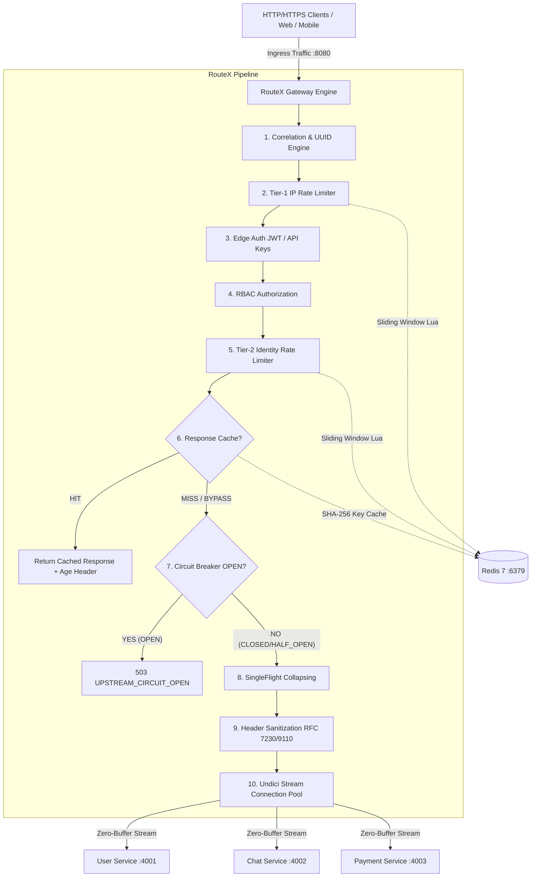
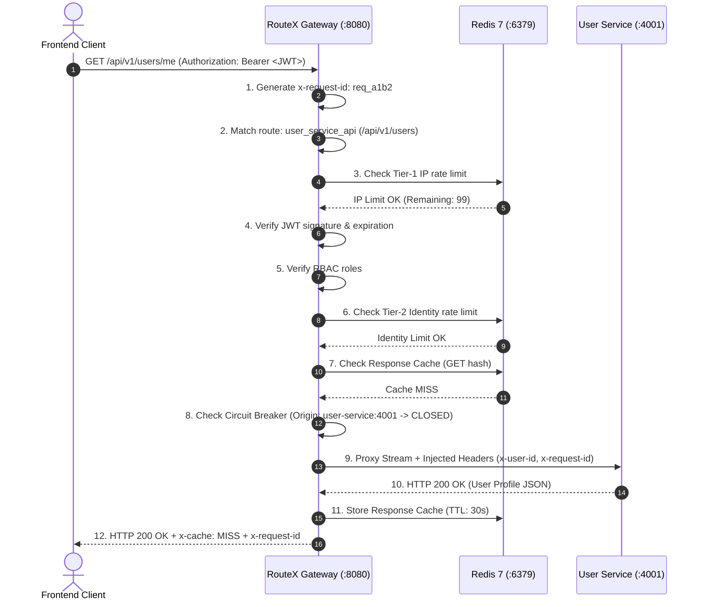

# RouteX — High-Performance Edge API Gateway & Reverse Proxy

> Production-quality, resilient, zero-buffer streaming API Gateway built with Node.js, TypeScript, Fastify, Undici, Redis, and Docker.

---

## Table of Contents
1. [Architecture Overview](#architecture-overview)
2. [Integrating RouteX Into Your Application](#integrating-routex-into-your-application)
   - [The Integration Mental Model](#the-integration-mental-model)
   - [The Two Integration Models](#the-two-integration-models)
   - [Zero-to-Working Integration Guide (10 Steps)](#zero-to-working-integration-guide-10-steps)
   - [Real Worked Example Application](#real-worked-example-application)
   - [What the Developer Modifies vs What Stays Untouched](#what-the-developer-modifies-vs-what-stays-untouched)
   - [Docker Compose Integration: Same Stack vs External Services](#docker-compose-integration-same-stack-vs-external-services)
   - [Development vs Production Deployment](#development-vs-production-deployment)
   - [What Happens When My Application Sends a Request?](#what-happens-when-my-application-sends-a-request)
   - [Common Integration Mistakes & Gotchas](#common-integration-mistakes--gotchas)
   - [How to Add Another Backend Service](#how-to-add-another-backend-service)
   - [Client URLs vs Internal Upstream URLs](#client-urls-vs-internal-upstream-urls)
   - [Authentication & Identity Integration](#authentication--identity-integration)
   - [Practical Guide: Rate Limiting, Caching & Circuit Breaking](#practical-guide-rate-limiting-caching--circuit-breaking)
   - [RouteX Integration Checklist](#routex-integration-checklist)
   - [What You Don't Need to Change](#what-you-dont-need-to-change)
3. [Feature Matrix](#feature-matrix)
4. [Request Lifecycle Pipeline](#request-lifecycle-pipeline)
5. [Quickstart Guide](#quickstart-guide)
   - [Local Development](#local-development)
   - [Docker & Docker Compose](#docker--docker-compose)
6. [Configuration Reference](#configuration-reference)
7. [Operational Runbook](#operational-runbook)
   - [Health & Readiness Probes](#health--readiness-probes)
   - [Graceful Shutdown & Socket Draining](#graceful-shutdown--socket-draining)
   - [Structured Logging & Correlation](#structured-logging--correlation)
   - [Redis Fault Tolerance & Fail-Open Behavior](#redis-fault-tolerance--fail-open-behavior)
8. [Security Model](#security-model)
9. [Performance & Streaming Memory Profiling](#performance--streaming-memory-profiling)
10. [Troubleshooting Guide](#troubleshooting-guide)
11. [Automated Verification Suite](#automated-verification-suite)

---

## Architecture Overview



---

## Integrating RouteX Into Your Application

This section is a step-by-step, practical guide for developers who want to connect RouteX to their existing backend services and direct frontend/client traffic through the gateway.

### The Integration Mental Model

RouteX is an **Edge API Gateway and Reverse Proxy**. It acts as a single, hardened entry point in front of your backend microservices:

```
BEFORE ROUTEX:
Client / Frontend ───> Directly calls User Service (:4001)
                  ───> Directly calls Chat Service (:4002)
                  ───> Directly calls Payment Service (:4003)

AFTER ROUTEX:
Client / Frontend ───> RouteX Gateway (:8080)
                              │
                              ├───> User Service (:4001)
                              ├───> Chat Service (:4002)
                              └───> Payment Service (:4003)
```

- **Your backend services stay untouched**: Your services continue to execute business logic, query databases, and return responses. You **do not** rewrite your APIs to use RouteX.
- **RouteX handles cross-cutting concerns**: RouteX centralizes routing, authentication (JWT/API-keys), role-based access control (RBAC), distributed sliding-window rate limiting, HTTP response caching, circuit breaking, zero-buffer streaming, and RFC 7230/9110 header hygiene.
- **Trusted identity propagation**: Once RouteX authenticates a user, it injects verified HTTP headers (`x-user-id`, `x-user-roles`, `x-auth-type`) into the upstream request. Your downstream services can trust these headers and avoid redundant JWT decoding.

---

### The Two Integration Models

Depending on your organization's repository structure, choose the model that fits your architecture:

#### Option A: Dedicated Gateway Service (Recommended)

RouteX runs as an independent repository and containerized service in your infrastructure, sitting in front of your application services:

```
my-application/
  ├── frontend/
  ├── user-service/
  ├── chat-service/
  └── payment-service/

RouteX/ (Separate repo / container)
  ├── config/
  │   ├── gateway.docker.yaml
  │   └── routes.docker.yaml
  └── docker-compose.yml
```

#### Option B: Monorepo / Unified Deployment

If your team maintains a monorepo, RouteX lives in an `api-gateway/` or `routex/` directory and is orchestrated alongside your services in a shared `docker-compose.yml` or Kubernetes manifest.

---

### Zero-to-Working Integration Guide (10 Steps)

Follow these 10 steps to connect RouteX to your backend services:

#### Step 1 — Get RouteX

Clone the RouteX repository:

```bash
git clone https://github.com/ankit18193/RouteX.git
cd RouteX
```

You do **not** copy RouteX TypeScript source files into your backend application. RouteX is a standalone service packaged via Docker.

#### Step 2 — Identify Your Backend Services

List the URLs and ports of the backend services you want to place behind RouteX:

| Service Name | Internal Host & Port | Example Routes |
|---|---|---|
| **User Service** | `http://user-service:4001` | `/api/v1/users/*`, `/api/v1/auth/*` |
| **Chat Service** | `http://chat-service:4002` | `/api/v1/chats/*`, `/api/v1/messages/*` |
| **Payment Service** | `http://payment-service:4003` | `/api/v1/payments/*` |

*(Replace these with your actual container names/hostnames and ports).*

#### Step 3 — Configure Routes in `config/routes.docker.yaml`

Edit [`config/routes.docker.yaml`](file:///d:/RouteX/RouteX/config/routes.docker.yaml) to register your routes and upstream targets:

```yaml
routes:
  # 1. Public Authentication Route
  - id: auth_service_api
    pathPrefix: /api/v1/auth
    upstream: http://user-service:4001
    stripPrefix: false
    methods: [POST]
    auth:
      mode: public
    rateLimit:
      enabled: true
      windowSec: 60
      limit: 30
      failurePolicy: fail-open
    timeouts:
      connectTimeoutMs: 2000
      responseTimeoutMs: 3000

  # 2. Protected User Management Route
  - id: user_service_api
    pathPrefix: /api/v1/users
    upstream: http://user-service:4001
    stripPrefix: false
    methods: [GET, POST, PUT, PATCH, DELETE]
    auth:
      mode: jwt
      requiredRoles: []
    rateLimit:
      enabled: true
      windowSec: 60
      limit: 100
      tiers:
        free: 60
        premium: 500
    cache:
      enabled: true
      ttlSec: 30
      allowAuthenticated: true
    circuitBreaker:
      enabled: true
      failureThreshold: 5
      resetTimeoutMs: 10000
    timeouts:
      connectTimeoutMs: 2000
      responseTimeoutMs: 5000

  # 3. Chat & Messaging Route
  - id: chat_service_api
    pathPrefix: /api/v1/chats
    upstream: http://chat-service:4002
    stripPrefix: false
    methods: [GET, POST, PUT, DELETE]
    auth:
      mode: any
    rateLimit:
      enabled: true
      windowSec: 60
      limit: 120
    timeouts:
      connectTimeoutMs: 2000
      responseTimeoutMs: 5000
```

##### Field Reference for `routes.docker.yaml`:

| Field | Type | Description |
|---|---|---|
| `id` | `string` | Unique identifier for the route (e.g. `user_service_api`). |
| `pathPrefix` | `string` | URL prefix matched using longest-prefix matching (e.g. `/api/v1/users`). |
| `upstream` | `string` | Internal upstream URL (e.g. `http://user-service:4001`). Must include protocol. |
| `stripPrefix` | `boolean` | `false` preserves `pathPrefix` when proxying; `true` strips it before dispatching. |
| `methods` | `string[]` | HTTP methods allowed (e.g. `[GET, POST, PUT, DELETE]`). Unmatched methods return 405. |
| `auth.mode` | `enum` | `'public'` (no auth), `'jwt'` (Bearer token), `'api-key'` (`x-api-key`), `'any'` (JWT or API key). |
| `auth.requiredRoles` | `string[]` | RBAC roles required to access route (e.g. `['admin']`). |
| `rateLimit.enabled` | `boolean` | Activates Redis atomic sliding-window rate limiting. |
| `rateLimit.windowSec` | `number` | Rate limit window in seconds (default: `60`). |
| `rateLimit.limit` | `number` | Allowed request quota per window (default: `100`). |
| `rateLimit.tiers` | `record` | Tier-based quotas based on user/API-key tier (e.g. `free: 60`, `premium: 500`). |
| `cache.enabled` | `boolean` | Activates Redis response caching for safe GET requests. |
| `cache.ttlSec` | `number` | Time-to-live for cached responses in seconds. |
| `circuitBreaker.enabled` | `boolean` | Activates per-upstream circuit breaker protection. |
| `circuitBreaker.failureThreshold` | `number` | Consecutive 5xx failures required to trip breaker to `OPEN`. |
| `timeouts.responseTimeoutMs` | `number` | Maximum time to wait for upstream response before returning 504. |

#### Step 4 — Configure Gateway Settings in `config/gateway.docker.yaml`

Review [`config/gateway.docker.yaml`](file:///d:/RouteX/RouteX/config/gateway.docker.yaml):

```yaml
server:
  port: 8080
  host: 0.0.0.0
  requestTimeoutMs: 10000
  headersTimeoutMs: 11000
  maxHeaderSize: 16384
  trustedProxies:
    - 127.0.0.1
    - ::1
    - 172.16.0.0/12
    - 10.0.0.0/8
  logLevel: info
  logFormat: json

redis:
  host: redis
  port: 6379
  db: 0
  connectTimeoutMs: 3000
  keyPrefix: "routex:"

auth:
  jwt:
    enabled: true
    hs256Secret: "routex-dev-super-secret-key-for-testing-at-least-32-chars-long!"
  apiKey:
    enabled: true
    headerName: "x-api-key"
    cacheTtlSec: 300
```

#### Step 5 — Configure Environment Variables in `.env`

Copy `.env.example` to `.env`:

```bash
cp .env.example .env
```

Review `.env`:

```ini
# Server configuration
PORT=8080
HOST=0.0.0.0
LOG_LEVEL=info
LOG_FORMAT=json

# Configuration file paths (points to Docker configuration)
ROUTEX_CONFIG_PATH=config/gateway.docker.yaml
ROUTEX_ROUTES_PATH=config/routes.docker.yaml

# Redis configuration (inside Docker Compose, host is the service name 'redis')
REDIS_HOST=redis
REDIS_PORT=6379
REDIS_PASSWORD=

# Authentication secrets (Replace with your production secrets)
JWT_HS256_SECRET=your-32-character-or-longer-production-jwt-secret-key-here!
JWT_SECRET=your-32-character-or-longer-production-jwt-secret-key-here!
```

> [!IMPORTANT]
> Never commit `.env` to version control. The repository `.gitignore` automatically ignores `.env`. Use `.env.example` as a template.

#### Step 6 — Configure Docker Networking (`service-name` vs `localhost`)

When running inside Docker Compose:
- **CORRECT**: `upstream: http://user-service:4001` (Uses Docker internal DNS to resolve the container name).
- **INCORRECT**: `upstream: http://localhost:4001` (Resolves to the `routex-gateway` container itself, causing connection refused `502 BAD_GATEWAY`).

Ensure your services share a Docker network with RouteX (e.g. `routex-net`).

#### Step 7 — Start RouteX with Docker Compose

Build and launch the stack:

```bash
# Build the production Docker image
docker compose build

# Start the stack in background
docker compose up -d

# Check running container health
docker compose ps
```

Expected output:
```text
NAME                  SERVICE          STATUS                    PORTS
routex-gateway        routex-gateway   Up 2 minutes (healthy)    0.0.0.0:8080->8080/tcp
routex-redis          redis            Up 2 minutes (healthy)    0.0.0.0:6379->6379/tcp
routex-user-service   user-service     Up 2 minutes (healthy)    0.0.0.0:4001->4001/tcp
routex-chat-service   chat-service     Up 2 minutes (healthy)    0.0.0.0:4002->4002/tcp
```

#### Step 8 — Verify the Gateway Probes

Verify that RouteX and its dependencies are running and healthy:

```bash
# Liveness Probe (process health, memory usage)
curl -i http://localhost:8080/livez

# Readiness Probe (router, poolManager, Redis connectivity)
curl -i http://localhost:8080/readyz
```

Expected response for `/readyz`:
```json
{
  "status": "ok",
  "gateway": "RouteX",
  "checks": {
    "router": "ok",
    "poolManager": "ok",
    "redis": "ok"
  },
  "uptimeSec": 120
}
```

#### Step 9 — Change Your Client / Frontend Base URL

Update your frontend application (React, Vue, iOS, Android, etc.) or API client to send traffic through RouteX at port `8080`:

```javascript
// BEFORE: Directly contacting microservices
const USER_API = "http://localhost:4001/api/v1/users";
const CHAT_API = "http://localhost:4002/api/v1/chats";

// AFTER: All ingress traffic routes through RouteX Gateway
const API_BASE_URL = "http://localhost:8080";

// Fetch current user
const userRes = await fetch(`${API_BASE_URL}/api/v1/users/me`, {
  headers: { "Authorization": `Bearer ${token}` }
});

// Fetch chats
const chatRes = await fetch(`${API_BASE_URL}/api/v1/chats`, {
  headers: { "Authorization": `Bearer ${token}` }
});
```

#### Step 10 — Test Authentication & Trusted Identity Propagation

Send an authenticated request through RouteX:

```bash
# 1. Obtain a JWT token
TOKEN=$(curl -s -X POST http://localhost:8080/api/v1/auth/token \
  -H "Content-Type: application/json" \
  -d '{"sub":"usr_prod_101","roles":["user"]}' | jq -r .token)

# 2. Call protected user route through RouteX Gateway
curl -i -H "Authorization: Bearer $TOKEN" http://localhost:8080/api/v1/users/me
```

RouteX validates the JWT, enforces rate limits, checks RBAC, and injects verified identity headers before forwarding to `user-service`:
- `x-user-id: usr_prod_101`
- `x-user-roles: user`
- `x-auth-type: jwt`
- `x-gateway-auth-status: authenticated`

---

### Real Worked Example Application

Let's look at an end-to-end request flow for a realistic 3-service architecture:



---

### What the Developer Modifies vs What Stays Untouched

| File / Component | Modification Required? | Purpose & Developer Responsibility |
|---|:---:|---|
| [`config/routes.docker.yaml`](file:///d:/RouteX/RouteX/config/routes.docker.yaml) | **REQUIRED** | Declare your backend services, URL paths, auth requirements, rate limits, caching, and timeouts. |
| [`.env`](file:///d:/RouteX/RouteX/.env) | **REQUIRED** | Set environment-specific secrets (`JWT_HS256_SECRET`, `REDIS_HOST`, `PORT`). |
| [`config/gateway.docker.yaml`](file:///d:/RouteX/RouteX/config/gateway.docker.yaml) | **OPTIONAL** | Adjust global server timeouts, trusted proxy CIDRs, and logging level/format. |
| [`docker-compose.yml`](file:///d:/RouteX/RouteX/docker-compose.yml) | **OPTIONAL** | Replace mock services with your actual application containers or attach external networks. |
| [`Dockerfile`](file:///d:/RouteX/RouteX/Dockerfile) | **DO NOT TOUCH** | Production multi-stage Alpine build already configured and optimized. |
| `src/**` (All source code) | **DO NOT TOUCH** | Core gateway routing, streaming, crypto, and Redis Lua engines. |
| [`.env.example`](file:///d:/RouteX/RouteX/.env.example) | **REFERENCE ONLY** | Template for `.env`. Keep in sync if new environment variables are introduced. |

---

### Docker Compose Integration: Same Stack vs External Services

#### Case 1: Services in the Same `docker-compose.yml`

If your backend services run in the same Compose stack as RouteX:

```yaml
services:
  routex-gateway:
    build: .
    container_name: routex-gateway
    ports:
      - "8080:8080"
    environment:
      - REDIS_HOST=redis
      - ROUTEX_CONFIG_PATH=config/gateway.docker.yaml
      - ROUTEX_ROUTES_PATH=config/routes.docker.yaml
    networks:
      - app-net

  redis:
    image: redis:7-alpine
    container_name: routex-redis
    networks:
      - app-net

  my-user-service:
    image: my-org/user-service:latest
    container_name: my-user-service
    networks:
      - app-net
```

In `config/routes.docker.yaml`, set:
```yaml
upstream: http://my-user-service:4001
```

#### Case 2: Services on an External Docker Network or Host

If your backend services are running in a separate Compose project or on the host machine:

1. **Connect to an external Docker network**:
   ```yaml
   networks:
     routex-net:
       external: true
       name: my-existing-backend-network
   ```
2. **Or access the host machine from Docker (Development only)**:
   ```yaml
   # In routes.docker.yaml (Windows / macOS Docker Desktop):
   upstream: http://host.docker.internal:4001
   ```

---

### Development vs Production Deployment

| Consideration | Local Development | Cloud Production (Kubernetes / AWS ECS / VMs) |
|---|---|---|
| **Orchestration** | `docker compose up -d` | Kubernetes Deployment / ECS Task Definition / Docker Swarm |
| **Ingress Point** | `http://localhost:8080` | Cloud Load Balancer (AWS ALB, Cloudflare, NGINX Ingress) |
| **Redis** | Local container (`redis:7-alpine`) | Managed Redis Cluster (AWS ElastiCache, Redis Enterprise) |
| **Secrets** | Local `.env` file | AWS Secrets Manager, HashiCorp Vault, Kubernetes Secrets |
| **Health Checks** | Compose `healthcheck` on `/livez` | K8s Liveness (`/livez`) & Readiness (`/readyz`) probes |

---

### What Happens When My Application Sends a Request?

When a client makes a request to `GET http://localhost:8080/api/v1/users/me`:

1. **Correlation**: RouteX reads or generates `x-request-id` (e.g. `req_70b57b88-e765-406a...`) and initializes high-resolution nanosecond timers.
2. **Route Resolution**: Matches `/api/v1/users/me` to the `user_service_api` route definition.
3. **Tier-1 IP Rate Limiting**: Evaluates client IP quota in Redis. Rejects with 429 if the IP exceeded its limit.
4. **Edge Authentication**: Validates the `Authorization: Bearer <JWT>` header using cryptographic signature verification (HS256/RS256). Rejects with 401 if missing, expired, or tampered.
5. **RBAC Authorization**: Checks if user's roles satisfy the route's `requiredRoles`. Rejects with 403 if unauthorized.
6. **Tier-2 Identity Rate Limiting**: Evaluates the authenticated user's tier (`free`, `premium`) in Redis.
7. **Cache Check**: Computes SHA-256 cache key. If found in Redis, immediately returns cached payload with `x-cache: HIT`.
8. **Circuit Breaker Check**: Verifies that the upstream `http://user-service:4001` circuit is `CLOSED`. If `OPEN`, fast-fails with 503 (`UPSTREAM_CIRCUIT_OPEN`).
9. **SingleFlight Collapsing**: If multiple clients request the same uncached URL simultaneously, RouteX collapses them into a single upstream request.
10. **Header Sanitization**: Strips client-forged headers (`x-user-id`, `x-user-roles`) and hop-by-hop headers (`Connection`, `Keep-Alive`). Injects verified identity headers.
11. **Zero-Buffer Proxy Streaming**: Directly pipes response stream from upstream `user-service:4001` back to client without accumulating chunks in Node.js heap.
12. **Observability & Caching**: Emits structured JSON access log with latency breakdown (`gatewayOverheadMs`, `upstreamLatencyMs`) and asynchronously caches response if eligible.

---

### Common Integration Mistakes & Gotchas

1. **Using `localhost` instead of container service names**: Inside Docker, `http://localhost:4001` targets the gateway container itself. Always use `http://user-service:4001`.
2. **Missing `stripPrefix` setting**: If your upstream expects `/users/me` instead of `/api/v1/users/me`, set `stripPrefix: true`.
3. **Frontend calling microservices directly**: Ensure your frontend client base URL points to `http://localhost:8080` (RouteX) rather than direct backend ports.
4. **Committing `.env` with secrets**: Keep `.env` gitignored; use environment injection in CI/CD.
5. **Short JWT secrets**: RouteX requires HS256 secrets to be at least 32 characters long for cryptographic security.
6. **Mismatched Docker networks**: If RouteX cannot reach your services, verify with `docker network inspect routex_routex-net` that all containers share the network.
7. **Trusting client identity headers in backend services**: Backend services should read `x-user-id` injected by RouteX, but must ensure ingress from the gateway is protected.
8. **Forgetting to rebuild after YAML changes**: If running in Docker, restart RouteX with `docker compose restart routex-gateway` to reload configuration.
9. **Redis connectivity failure**: If Redis is unreachable and `failurePolicy: fail-closed`, rate limiting will reject requests. Set `failurePolicy: fail-open` if you prefer resilient pass-through during Redis degradation.
10. **Unmatched HTTP methods**: If a route specifies `methods: [GET]`, a `POST` request will receive `405 Method Not Allowed` with an `Allow: GET` header.
11. **Trailing slash in `pathPrefix`**: `pathPrefix` must not have a trailing slash (e.g. use `/api/v1/users`, not `/api/v1/users/`).
12. **Assuming RouteX handles database business logic**: RouteX is an edge gateway and reverse proxy; your backend services continue to handle database transactions and application state.

---

### How to Add Another Backend Service

To add a new backend service (e.g. `Order Service` on port `4004`):

#### 1. Add Route in `config/routes.docker.yaml`:
```yaml
  - id: order_service_api
    pathPrefix: /api/v1/orders
    upstream: http://order-service:4004
    stripPrefix: false
    methods: [GET, POST, PUT, DELETE]
    auth:
      mode: jwt
      requiredRoles: ["user", "admin"]
    rateLimit:
      enabled: true
      windowSec: 60
      limit: 100
    circuitBreaker:
      enabled: true
      failureThreshold: 5
      resetTimeoutMs: 10000
    timeouts:
      connectTimeoutMs: 2000
      responseTimeoutMs: 5000
```

#### 2. Add Service to `docker-compose.yml` (if managed locally):
```yaml
  order-service:
    image: my-org/order-service:latest
    container_name: routex-order-service
    ports:
      - "4004:4004"
    networks:
      - routex-net
```

#### 3. Restart RouteX:
```bash
docker compose up -d
```

---

### Client URLs vs Internal Upstream URLs

```
+─────────────────────────────────────────────────────────────────────────────+
| CLIENT / PUBLIC FACING URL (Calls RouteX Port 8080)                         |
|   https://api.yourdomain.com/api/v1/users/profile                           |
|   http://localhost:8080/api/v1/users/profile                                |
+──────────────────────────────────────┬──────────────────────────────────────+
                                       │ (RouteX evaluates pathPrefix: /api/v1/users)
                                       ▼
+─────────────────────────────────────────────────────────────────────────────+
| INTERNAL UPSTREAM URL (Dispatched by RouteX to Backend Service)             |
|   http://user-service:4001/api/v1/users/profile                             |
+─────────────────────────────────────────────────────────────────────────────+
```

Clients never need to know internal hostnames, internal ports, or microservice topology.

---

### Authentication & Identity Integration

RouteX supports four declarative route authentication modes:

#### 1. `mode: public`
No authentication required. Ingress requests pass directly to upstream with Tier-1 IP rate limiting:
```yaml
auth:
  mode: public
```

#### 2. `mode: jwt`
Requires a valid `Authorization: Bearer <token>` header. RouteX verifies the cryptographic signature (HS256/RS256), expiration (`exp`), issuer (`iss`), and audience (`aud`):
```yaml
auth:
  mode: jwt
  requiredRoles: ["admin"]
```

#### 3. `mode: api-key`
Requires a valid API key passed via `x-api-key` header:
```yaml
auth:
  mode: api-key
```

#### 4. `mode: any`
Permits access if either a valid JWT Bearer token or a valid API key is supplied:
```yaml
auth:
  mode: any
```

##### Downstream Injected Headers
Upon successful authentication, RouteX injects trusted headers:
- `x-user-id`: Authenticated user ID (e.g. `usr_123`).
- `x-user-roles`: Comma-separated list of roles (e.g. `admin,billing`).
- `x-auth-type`: Authentication type (`jwt` or `api-key`).
- `x-gateway-auth-status`: `authenticated`.

---

### Practical Guide: Rate Limiting, Caching & Circuit Breaking

```
+─────────────────────────────────────────────────────────────────────────────+
|                        FEATURE SELECTION MATRIX                             |
+────────────────────┬─────────────────────────────┬──────────────────────────+
| Feature            | When to Enable              | Configuration Target     |
+────────────────────┼─────────────────────────────┼──────────────────────────+
| Rate Limiting      | Protect login endpoints,    | rateLimit:               |
|                    | public APIs, and prevent    |   windowSec: 60          |
|                    | abuse / DoS.                |   limit: 100             |
+────────────────────┼─────────────────────────────┼──────────────────────────+
| Response Caching   | Safe, idempotent GET APIs   | cache:                   |
|                    | with high read volume and   |   enabled: true          |
|                    | low change frequency.       |   ttlSec: 30             |
+────────────────────┼─────────────────────────────┼──────────────────────────+
| Circuit Breaker    | Protect gateway and healthy | circuitBreaker:          |
|                    | services when an upstream   |   enabled: true          |
|                    | encounters cascade failures.|   failureThreshold: 5    |
+────────────────────┴─────────────────────────────┴──────────────────────────+
```

---

### RouteX Integration Checklist

Before deploying your integrated application to production, verify:

- [ ] RouteX repository cloned and built (`docker compose build`).
- [ ] Backend service container names and ports verified.
- [ ] `config/routes.docker.yaml` updated with all required route prefixes.
- [ ] `config/gateway.docker.yaml` reviewed for timeouts and proxy CIDRs.
- [ ] `.env` created from `.env.example` with strong production secrets.
- [ ] `.env` is ignored by Git and not committed.
- [ ] Docker network configured and shared across containers.
- [ ] `/livez` probe returns `200 OK`.
- [ ] `/readyz` probe returns `200 OK` (`router: ok`, `poolManager: ok`, `redis: ok`).
- [ ] Public routes verified (`mode: public`).
- [ ] Protected routes verified with valid JWT (`mode: jwt`).
- [ ] Tampered/expired JWT verified to return `401 UNAUTHORIZED`.
- [ ] Header spoofing verified (malicious client headers stripped).
- [ ] Client/frontend base URL updated to RouteX port `8080`.

---

### What You Don't Need to Change

When integrating RouteX into your stack, you do **NOT** need to write code for or modify:
- Fastify server configuration or routing plugins.
- Undici stream connection pool managers.
- Cryptographic JWT verifiers or API-key constant-time comparison algorithms.
- Redis Sliding Window Lua scripts.
- SingleFlight mutex coalescing engine.
- Circuit breaker state machines (`CLOSED` $\rightarrow$ `OPEN` $\rightarrow$ `HALF_OPEN`).
- Header sanitization pipelines.

All functionality is driven declaratively through [`config/routes.docker.yaml`](file:///d:/RouteX/RouteX/config/routes.docker.yaml) and environment variables.

---

## Feature Matrix

| Phase | Engine Area | Implementation Highlights |
|---|---|---|
| **Phase 1** | **Core Foundation** | Strict Zod configuration validation, standard JSON error envelopes, high-resolution nanosecond timing (`hrtime.bigint`), structured Pino logging, UUIDv4 request correlation. |
| **Phase 2** | **Mock Ecosystem** | Mock User Service (port 4001) & Mock Chat Service (port 4002) supporting cryptographic JWT generation, chunked streaming payloads, delay injection, and fault simulations. |
| **Phase 3** | **Zero-Buffer Proxy** | `ProxyRouter` longest-prefix route matching, `UpstreamPoolManager` Undici connection pooling with keep-alive, RFC 7230/9110 hop-by-hop header stripping, zero-buffer duplex streaming. |
| **Phase 4** | **Auth & Identity** | Multi-mode route security (`public`, `jwt`, `api-key`, `any`), RS256/HS256 cryptographic JWT verification, constant-time API-key hash matching (`timingSafeEqual`), bounded LRU key cache, RBAC authorization, identity header propagation. |
| **Phase 5** | **Distributed Rate Limiting** | Two-tier atomic Redis Sliding Window Log via custom Lua scripts (`EVALSHA` / `NOSCRIPT` fallback), Tier-1 IP protection, Tier-2 authenticated Identity limits, per-route subscription tiers (`free`, `premium`), `X-RateLimit-*` & `Retry-After` RFC-compliant headers. |
| **Phase 6** | **Cache & Circuit Breaker** | Distributed Redis HTTP response caching, deterministic query-sorted cache keys, SingleFlight cache stampede protection (coalescing 50+ concurrent requests into 1 upstream fetch), per-origin Circuit Breaker state machine (`CLOSED` $\rightarrow$ `OPEN` $\rightarrow$ `HALF_OPEN`) with origin isolation. |
| **Phase 7** | **Production Delivery** | Multi-stage production `Dockerfile`, `docker-compose.yml`, health probes (`/healthz`, `/livez`, `/readyz`), graceful socket draining, 15MB+ streaming memory verification (< 35MB growth), 300+ automated end-to-end acceptance tests. |

---

## Request Lifecycle Pipeline

Every request traversing RouteX undergoes a strict deterministic 10-step lifecycle:

1. **Correlation & Timing**: A unique `x-request-id` is assigned or normalized, and a high-resolution timer (`startTime`) is initialized.
2. **Route Resolution**: `ProxyRouter` evaluates the request URL against configured routes using longest-prefix matching. Returns 404 (`ROUTE_NOT_FOUND`) if unmatched, or 405 (`METHOD_NOT_ALLOWED`) with `Allow` header if method mismatch.
3. **Tier-1 IP Rate Limiting**: Redis atomic sliding-window evaluates client IP limit. If exhausted, returns 429 (`TOO_MANY_REQUESTS`) with `Retry-After`.
4. **Edge Authentication**: Validates credentials (JWT signature/expiration or API key hash). Populates trusted `AuthContext`.
5. **RBAC Authorization**: Verifies `AuthContext.roles` satisfy route's `requiredRoles`. Rejects with 403 (`FORBIDDEN`) on mismatch.
6. **Tier-2 Identity Rate Limiting**: Evaluates authenticated user ID or API key against tier quotas (`free`, `premium`, `enterprise`).
7. **Response Cache Lookup**: For safe GET requests on cacheable routes, checks Redis for deterministic hashed key. On `HIT`, serves immediately with `age` and `x-cache: HIT`.
8. **Upstream Circuit Breaker Check**: Verifies origin circuit breaker state. If `OPEN`, fast-fails immediately with 503 (`UPSTREAM_CIRCUIT_OPEN`) and `Retry-After`.
9. **SingleFlight Stampede Protection & Forwarding**: Coalesces concurrent cache misses into a single upstream request. Sanitizes hop-by-hop headers and injects verified identity headers (`x-user-id`, `x-user-roles`, `x-auth-type`, `x-forwarded-*`).
10. **Zero-Buffer Duplex Streaming**: Streams response body directly from Undici pool back to client socket without buffering in Node.js heap. Records circuit breaker latency and status codes.

---

## Quickstart Guide

### Prerequisites
- Node.js >= 20.0.0
- Redis >= 6.2 (or Docker)

### Local Development

1. **Install Dependencies**:
   ```bash
   npm install
   ```

2. **Start Background Services (Redis & Mock Upstreams)**:
   ```bash
   # Terminal 1: Redis (if local)
   redis-server

   # Terminal 2: Mock User Service (Port 4001)
   npm run start:user

   # Terminal 3: Mock Chat Service (Port 4002)
   npm run start:chat
   ```

3. **Start RouteX Gateway**:
   ```bash
   npm start
   ```
   Gateway listens on `http://127.0.0.1:8080`.

4. **Verify Liveness & Readiness**:
   ```bash
   curl http://127.0.0.1:8080/healthz
   curl http://127.0.0.1:8080/readyz
   ```

---

### Docker & Docker Compose

Deploy the complete multi-container production topology with a single command:

```bash
docker compose up --build -d
```

The stack orchestrates:
- `redis`: Redis 7 alpine container with persistent healthcheck probe.
- `user-service`: Mock User Service on internal port 4001.
- `chat-service`: Mock Chat Service on internal port 4002.
- `routex-gateway`: Production-hardened Node.js Alpine container on port 8080 running as non-root user `node`.

---

## Configuration Reference

RouteX is configured via declarative YAML (`config/gateway.config.yaml` or `config/gateway.docker.yaml`).

```yaml
server:
  port: 8080
  host: 0.0.0.0
  requestTimeoutMs: 10000
  headersTimeoutMs: 11000
  maxHeaderSize: 16384
  logLevel: info
  logFormat: json
  trustedProxies:
    - 127.0.0.1
    - 10.0.0.0/8

redis:
  enabled: true
  host: redis
  port: 6379
  db: 0
  connectTimeoutMs: 3000
  commandTimeoutMs: 2000
  keyPrefix: "routex:"

auth:
  jwt:
    enabled: true
    algorithms: ["HS256", "RS256"]
    hs256SecretEnv: JWT_SECRET
  apiKeys:
    enabled: true
    cacheTtlMs: 60000
    cacheMaxEntries: 1000
    keys:
      - id: key_prod_01
        key: rx_live_9f83b2a1c4e7d0f2a6b8c9d1e3f5a7b9
        userId: usr_enterprise_corp
        roles: ["admin", "api:write"]
        tier: premium

routes:
  - id: users_service
    pathPrefix: /api/v1/users
    upstream: http://user-service:4001
    stripPrefix: false
    methods: [GET, POST, PUT, DELETE]
    auth:
      mode: jwt
      requiredRoles: []
    rateLimit:
      enabled: true
      windowSec: 60
      limit: 100
      ipLimit: 20
      tiers:
        free: 60
        premium: 300
    cache:
      enabled: true
      ttlSec: 60
      maxBodyBytes: 1048576
    circuitBreaker:
      enabled: true
      failureThreshold: 5
      resetTimeoutMs: 10000
      failureStatusCodes: [500, 502, 503, 504]
    timeouts:
      connectTimeoutMs: 1000
      responseTimeoutMs: 5000
```

---

## Operational Runbook

### Health & Readiness Probes

RouteX provides three dedicated endpoints for container orchestrators (Kubernetes, Docker, Nomad):

| Endpoint | Probe Type | Verification Performed | Status Codes |
|---|---|---|---|
| `/livez` | **Liveness** | Verifies Gateway event loop is responsive, Node process uptime, and memory statistics. | `200 OK` |
| `/readyz` | **Readiness** | Pings Redis connection, validates router & pool manager, checks shutdown state (`isShuttingDown`). | `200 OK` (Healthy) / `503 Service Unavailable` |
| `/healthz` | **General** | Aggregated health overview including version and gateway state. | `200 OK` |

### Graceful Shutdown & Socket Draining

When receiving `SIGTERM` or `SIGINT`:
1. `isShuttingDown` flag is flipped to `true`.
2. `/readyz` immediately returns `503 Service Unavailable`, prompting load balancers to route new traffic away.
3. Idle HTTP keep-alive connections are severed via `server.closeIdleConnections()`.
4. In-flight requests are permitted to finish streaming within their timeout budget.
5. Undici upstream pools and Redis connections are closed cleanly.

### Structured Logging & Correlation

All ingress requests produce structured JSON logs with high-resolution latency breakdown:

```json
{
  "level": "info",
  "time": "2026-08-30T13:11:19.460Z",
  "name": "routex-gateway",
  "type": "ACCESS_LOG",
  "requestId": "req_38df0886-fa10-4b96-b67d-b7a93fe83254",
  "method": "GET",
  "url": "/api/v1/chats",
  "statusCode": 200,
  "routeId": "chat_service_api",
  "totalDurationMs": 9.779,
  "upstreamLatencyMs": 5.11,
  "gatewayOverheadMs": 4.669,
  "clientIp": "172.18.0.1",
  "userAgent": "curl/8.21.0",
  "cache_status": "BYPASS",
  "circuit_state": "CLOSED",
  "circuit_rejected": false
}
```

### Redis Fault Tolerance & Fail-Open Behavior

When Redis encounters network partitions or connectivity loss:
- `failurePolicy: "fail-open"` (default): Rate limiting permits traffic with a logged warning, preventing gateway outages caused by cache layer issues.
- `failurePolicy: "fail-closed"`: Rate limiting rejects incoming traffic with 429 when strict financial quotas must be enforced.
- Redis client implements bounded exponential reconnect backoff with error suppression to prevent unhandled process crashes.

---

## Security Model

1. **Header Spoofing Prevention**: Downstream requests attempting to forge internal identity headers (`x-user-id`, `x-user-roles`, `x-auth-type`, `x-auth-claims`, `x-gateway-*`, `x-internal-*`) are unconditionally stripped.
2. **RFC 7230/9110 Header Hygiene**: Standard and dynamic `Connection` nominated hop-by-hop headers are removed before upstream proxy dispatch.
3. **CRLF Injection Neutralization**: All request and response header values are sanitized against carriage return (`\r`) and newline (`\n`) characters.
4. **Constant-Time Key Matching**: API keys are hashed with SHA-256 and compared using `crypto.timingSafeEqual` to prevent side-channel timing attacks.
5. **Cryptographic Algorithm Validation**: Rejects tokens using `alg: "none"` or unapproved algorithms.

---

## Performance & Streaming Memory Profiling

RouteX enforces zero-buffer streaming across request upload and response download pipelines:

- **Low Overhead**: Sub-millisecond median routing overhead (+0.04 ms p50 overhead).
- **High Concurrency**: 700+ requests/sec at 50 concurrent connections in local benchmarks.
- **Download Streaming Benchmark**: Streaming large payloads (15MB+) through RouteX yields less than **35MB** peak heap growth, proving that memory does not scale linearly with payload size.
- **Upload Streaming Benchmark**: Multi-chunk request bodies are piped directly to upstream HTTP sockets via chunked transfer encoding.
- **SingleFlight Stampede Coalescing**: 50 concurrent requests for an uncached URL collapse into exactly 1 upstream dispatch, eliminating backend database spikes.

---

## Troubleshooting Guide

| Symptom | Probable Cause | Diagnostic & Resolution |
|---|---|---|
| `502 BAD_GATEWAY` | Upstream service down, wrong port, or `localhost` used in Docker. | Verify upstream service is running and listening. Inside Docker, use `http://service-name:port` instead of `localhost`. |
| `504 GATEWAY_TIMEOUT` | Upstream latency exceeded `responseTimeoutMs`. | Check upstream performance or increase `timeouts.responseTimeoutMs` in `routes.docker.yaml`. |
| `503 UPSTREAM_CIRCUIT_OPEN` | Consecutive failures exceeded `failureThreshold`. | Upstream has failed repeatedly. Inspect upstream logs. Breaker will automatically probe in `HALF_OPEN` after `resetTimeoutMs`. |
| `429 TOO_MANY_REQUESTS` | IP or Identity rate limit window exhausted. | Inspect `X-RateLimit-Limit`, `X-RateLimit-Remaining`, and `Retry-After` headers. |
| `401 UNAUTHORIZED` | Invalid JWT signature, expired token, or invalid API key. | Verify JWT secret/public key configuration or ensure API key format matches `rx_live_*`. |
| `403 FORBIDDEN` | Authenticated identity lacks required RBAC roles. | Verify `authContext.roles` contains roles specified in `route.auth.requiredRoles`. |
| `404 ROUTE_NOT_FOUND` | Path does not match any configured `pathPrefix`. | Verify route entry in `routes.docker.yaml` matches the incoming request path. |
| `405 METHOD_NOT_ALLOWED` | HTTP method not declared in route's `methods` array. | Add the method (e.g. `POST`, `PUT`, `DELETE`) to the route's `methods` array. |

---

## Automated Verification Suite

To run the complete automated test suite (unit, integration, and E2E acceptance tests):

```bash
# Run all unit, integration, and E2E tests (38 suites, 300 tests)
npm test

# Run tests with V8 code coverage report (>91.8% coverage)
npm run test:coverage

# Run TypeScript strict type verification
npm run typecheck

# Build production distribution bundle in dist/
npm run build
```

---

## License
MIT
