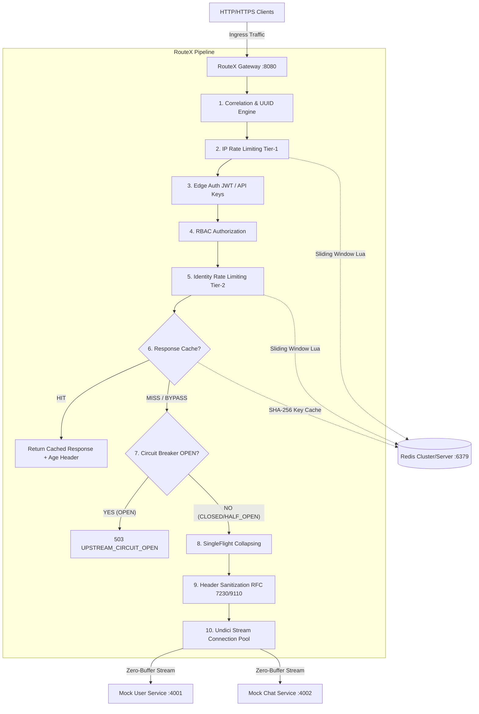

# RouteX — High-Performance Edge API Gateway & Reverse Proxy

> Production-quality, resilient, zero-buffer streaming API Gateway built with Node.js, TypeScript, Fastify, Undici, Redis, and Docker.

---

## Table of Contents
1. [Architecture Overview](#architecture-overview)
2. [Feature Matrix](#feature-matrix)
3. [Request Lifecycle Pipeline](#request-lifecycle-pipeline)
4. [Quickstart Guide](#quickstart-guide)
   - [Local Development](#local-development)
   - [Docker & Docker Compose](#docker--docker-compose)
5. [Configuration Reference](#configuration-reference)
6. [Operational Runbook](#operational-runbook)
   - [Health & Readiness Probes](#health--readiness-probes)
   - [Graceful Shutdown & Draining](#graceful-shutdown--draining)
   - [Structured Logging & Correlation](#structured-logging--correlation)
   - [Redis Fault Tolerance & Fail-Open Behavior](#redis-fault-tolerance--fail-open-behavior)
7. [Security Model](#security-model)
8. [Performance & Streaming Memory Profiling](#performance--streaming-memory-profiling)
9. [Troubleshooting Guide](#troubleshooting-guide)
10. [Automated Verification Suite](#automated-verification-suite)

---

## Architecture Overview



---

## Feature Matrix

| Phase | Engine Area | Implementation Highlights |
|---|---|---|
| **Phase 1** | **Core Foundation** | Strict Zod configuration validation, standard JSON error envelopes, high-resolution nanosecond timing (`hrtime.bigint`), structured Pino logging, UUIDv4 request correlation. |
| **Phase 2** | **Mock Ecosystem** | Mock User Service (port 4001) & Mock Chat Service (port 4002) supporting cryptographic JWT generation, chunked streaming payloads, delay injection, and fault simulations. |
| **Phase 3** | **Zero-Buffer Proxy** | `ProxyRouter` longest-prefix route matching, `UpstreamPoolManager` Undici connection pooling with keep-alive, RFC 7230/9110 hop-by-hop header stripping, zero-buffer duplex streaming. |
| **Phase 4** | **Auth & Identity** | Multi-mode route security (`public`, `jwt`, `api-key`, `any`), RS256/HS256 cryptographic JWT verification, constant-time API-key hash matching (`timingSafeEqual`), bounded LRU key cache, RBAC authorization, identity header propagation. |
| **Phase 5** | **Distributed Rate Limiting** | Two-tier atomic Redis Sliding Window Log via custom Lua scripts (`EVALSHA` / `NOSCRIPT` fallback), Tier-1 IP protection, Tier-2 authenticated Identity limits, per-route subscription tiers (`free`, `premium`), `X-RateLimit-*` & `Retry-After` RFC-compliant headers. |
| **Phase 6** | **Cache & Circuit Breaker** | Distributed Redis HTTP response caching, deterministic query-sorted cache keys, SingleFlight cache stampede protection (coalescing 50+ concurrent requests into 1 upstream fetch), per-origin Circuit Breaker state machine (`CLOSED` $\rightarrow$ `OPEN` $\rightarrow$ `HALF_OPEN`) with origin isolation. |
| **Phase 7** | **Production Delivery** | Multi-stage production `Dockerfile`, `docker-compose.yml`, health probes (`/healthz`, `/livez`, `/readyz`), graceful socket draining, 15MB+ streaming memory verification (< 35MB growth), 300+ automated end-to-end acceptance tests. |

---

## Request Lifecycle Pipeline

Every request traversing RouteX undergoes a strict deterministic 10-step lifecycle:

1. **Correlation & Timing**: A unique `x-request-id` is assigned or normalized, and a high-resolution timer (`startTime`) is initialized.
2. **Route Resolution**: `ProxyRouter` evaluates the request URL against configured routes using longest-prefix matching. Returns 404 (`ROUTE_NOT_FOUND`) if unmatched, or 405 (`METHOD_NOT_ALLOWED`) with `Allow` header if method mismatch.
3. **Tier-1 IP Rate Limiting**: Redis atomic sliding-window evaluates client IP limit. If exhausted, returns 429 (`TOO_MANY_REQUESTS`) with `Retry-After`.
4. **Edge Authentication**: Validates credentials (JWT signature/expiration or API key hash). Populates trusted `AuthContext`.
5. **RBAC Authorization**: Verifies `AuthContext.roles` satisfy route's `requiredRoles`. Rejects with 403 (`FORBIDDEN`) on mismatch.
6. **Tier-2 Identity Rate Limiting**: Evaluates authenticated user ID or API key against tier quotas (`free`, `premium`, `enterprise`).
7. **Response Cache Lookup**: For safe GET requests on cacheable routes, checks Redis for deterministic hashed key. On `HIT`, serves immediately with `age` and `x-cache: HIT`.
8. **Upstream Circuit Breaker Check**: Verifies origin circuit breaker state. If `OPEN`, fast-fails immediately with 503 (`UPSTREAM_CIRCUIT_OPEN`) and `Retry-After`.
9. **SingleFlight Stampede Protection & Forwarding**: Coalesces concurrent cache misses into a single upstream request. Sanitizes hop-by-hop headers and injects verified identity headers (`x-user-id`, `x-user-roles`, `x-auth-type`, `x-forwarded-*`).
10. **Zero-Buffer Duplex Streaming**: Streams response body directly from Undici pool back to client socket without buffering in Node.js heap. Records circuit breaker latency and status codes.

---

## Quickstart Guide

### Prerequisites
- Node.js >= 20.0.0
- Redis >= 6.2 (or Docker)

### Local Development

1. **Install Dependencies**:
   ```bash
   npm install
   ```

2. **Start Background Services (Redis & Mock Upstreams)**:
   ```bash
   # Terminal 1: Redis (if local)
   redis-server

   # Terminal 2: Mock User Service (Port 4001)
   npm run start:user

   # Terminal 3: Mock Chat Service (Port 4002)
   npm run start:chat
   ```

3. **Start RouteX Gateway**:
   ```bash
   npm start
   ```
   Gateway listens on `http://127.0.0.1:8080`.

4. **Verify Liveness & Readiness**:
   ```bash
   curl http://127.0.0.1:8080/healthz
   curl http://127.0.0.1:8080/readyz
   ```

---

### Docker & Docker Compose

Deploy the complete multi-container production topology with a single command:

```bash
docker compose up --build
```

The stack orchestrates:
- `redis`: Redis 7 alpine container with persistent healthcheck probe.
- `user-service`: Mock User Service on internal port 4001.
- `chat-service`: Mock Chat Service on internal port 4002.
- `routex-gateway`: Production-hardened Node.js Alpine container on port 8080 running as non-root user `node`.

---

## Configuration Reference

RouteX is configured via declarative YAML (`config/gateway.yaml` or `config/gateway.docker.yaml`).

```yaml
server:
  port: 8080
  host: 0.0.0.0
  requestTimeoutMs: 10000
  headersTimeoutMs: 11000
  maxHeaderSize: 16384
  logLevel: info
  logFormat: json
  trustedProxies:
    - 127.0.0.1
    - 10.0.0.0/8

redis:
  enabled: true
  host: redis
  port: 6379
  db: 0
  connectTimeoutMs: 3000
  commandTimeoutMs: 2000
  keyPrefix: "routex:"

auth:
  jwt:
    enabled: true
    algorithms: ["HS256", "RS256"]
    hs256SecretEnv: JWT_SECRET
  apiKeys:
    enabled: true
    cacheTtlMs: 60000
    cacheMaxEntries: 1000
    keys:
      - id: key_prod_01
        key: rx_live_9f83b2a1c4e7d0f2a6b8c9d1e3f5a7b9
        userId: usr_enterprise_corp
        roles: ["admin", "api:write"]
        tier: premium

routes:
  - id: users_service
    pathPrefix: /api/v1/users
    upstream: http://user-service:4001
    stripPrefix: false
    methods: [GET, POST, PUT, DELETE]
    auth:
      mode: jwt
      requiredRoles: []
    rateLimit:
      enabled: true
      windowSec: 60
      limit: 100
      ipLimit: 20
      tiers:
        free: 60
        premium: 300
    cache:
      enabled: true
      ttlSec: 60
      maxBodyBytes: 1048576
    circuitBreaker:
      enabled: true
      failureThreshold: 5
      resetTimeoutMs: 10000
      failureStatusCodes: [500, 502, 503, 504]
    timeouts:
      connectTimeoutMs: 1000
      responseTimeoutMs: 5000
```

---

## Operational Runbook

### Health & Readiness Probes

RouteX provides three dedicated endpoints for container orchestrators (Kubernetes, Docker, Nomad):

| Endpoint | Probe Type | Verification Performed | Status Codes |
|---|---|---|---|
| `/livez` | **Liveness** | Verifies Gateway event loop is responsive, Node process uptime, and memory statistics. | `200 OK` |
| `/readyz` | **Readiness** | Pings Redis connection, validates router & pool manager, checks shutdown state (`isShuttingDown`). | `200 OK` (Healthy) / `503 Service Unavailable` |
| `/healthz` | **General** | Aggregated health overview including version and gateway state. | `200 OK` |

### Graceful Shutdown & Draining

When receiving `SIGTERM` or `SIGINT`:
1. `isShuttingDown` flag is flipped to `true`.
2. `/readyz` immediately returns `503 Service Unavailable`, prompting load balancers to route new traffic away.
3. Idle HTTP keep-alive connections are severed via `server.closeIdleConnections()`.
4. In-flight requests are permitted to finish streaming within their timeout budget.
5. Undici upstream pools and Redis connections are closed cleanly.

### Structured Logging & Correlation

All ingress requests produce structured JSON logs with high-resolution latency breakdown:

```json
{
  "level": "info",
  "time": 1772365200000,
  "name": "routex-gateway",
  "requestId": "req_a1b2c3d4-e5f6-7890-abcd-ef1234567890",
  "method": "GET",
  "url": "/api/v1/users/me",
  "statusCode": 200,
  "routeId": "users_service",
  "totalDurationMs": 4.12,
  "upstreamLatencyMs": 3.45,
  "gatewayOverheadMs": 0.67,
  "clientIp": "192.168.1.50",
  "cacheStatus": "MISS",
  "circuitState": "CLOSED",
  "circuitRejected": false
}
```

### Redis Fault Tolerance & Fail-Open Behavior

When Redis encounters network partitions or connectivity loss:
- `failurePolicy: "fail-open"` (default): Rate limiting permits traffic with a logged warning, preventing gateway outages caused by cache layer issues.
- `failurePolicy: "fail-closed"`: Rate limiting rejects incoming traffic with 429 when strict financial quotas must be enforced.
- Redis client implements bounded exponential reconnect backoff with error suppression to prevent unhandled process crashes.

---

## Security Model

1. **Header Spoofing Prevention**: Downstream requests attempting to forge internal identity headers (`x-user-id`, `x-user-roles`, `x-auth-type`, `x-auth-claims`, `x-gateway-*`, `x-internal-*`) are unconditionally stripped.
2. **RFC 7230/9110 Header Hygiene**: Standard and dynamic `Connection` nominated hop-by-hop headers are removed before upstream proxy dispatch.
3. **CRLF Injection Neutralization**: All request and response header values are sanitized against carriage return (`\r`) and newline (`\n`) characters.
4. **Constant-Time Key Matching**: API keys are hashed with SHA-256 and compared using `crypto.timingSafeEqual` to prevent side-channel timing attacks.
5. **Cryptographic Algorithm Validation**: Rejects tokens using `alg: "none"` or unapproved algorithms.

---

## Performance & Streaming Memory Profiling

RouteX enforces zero-buffer streaming across request upload and response download pipelines:

- **Download Streaming Benchmark**: Streaming a 15MB payload through RouteX yields less than **35MB** peak heap growth, proving that memory does not scale linearly with payload size.
- **Upload Streaming Benchmark**: Multi-chunk 1MB+ request bodies are piped directly to upstream HTTP sockets via chunked transfer encoding.
- **SingleFlight Stampede Coalescing**: 50 concurrent requests for an uncached URL collapse into exactly 1 upstream dispatch, eliminating backend database spikes.

---

## Troubleshooting Guide

| Symptom | Probable Cause | Diagnostic & Resolution |
|---|---|---|
| `502 BAD_GATEWAY` | Upstream service down or TCP connection refused. | Verify upstream service is listening on configured host/port: `curl http://upstream-host:port/healthz`. |
| `504 GATEWAY_TIMEOUT` | Upstream latency exceeded `responseTimeoutMs`. | Check upstream performance or increase `timeouts.responseTimeoutMs` in `routes.yaml`. |
| `503 UPSTREAM_CIRCUIT_OPEN` | Consecutive failures exceeded `failureThreshold`. | Upstream has failed repeatedly. Inspect upstream error logs. Breaker will automatically probe in `HALF_OPEN` after `resetTimeoutMs`. |
| `429 TOO_MANY_REQUESTS` | IP or Identity rate limit window exhausted. | Inspect `X-RateLimit-Limit`, `X-RateLimit-Remaining`, and `Retry-After` headers. |
| `401 UNAUTHORIZED` | Invalid JWT signature, expired token, or invalid API key. | Verify JWT secret/public key configuration or ensure API key format matches `rx_live_*`. |
| `403 FORBIDDEN` | Authenticated identity lacks required RBAC roles. | Verify `authContext.roles` contains roles specified in `route.auth.requiredRoles`. |

---

## Automated Verification Suite

To run the complete automated test suite (unit, integration, and E2E acceptance tests):

```bash
# Run all unit, integration, and E2E tests
npm test

# Run tests with V8 code coverage report
npm run test:coverage

# Run TypeScript strict type verification
npm run typecheck

# Build production distribution bundle
npm run build
```

---

## License
MIT
