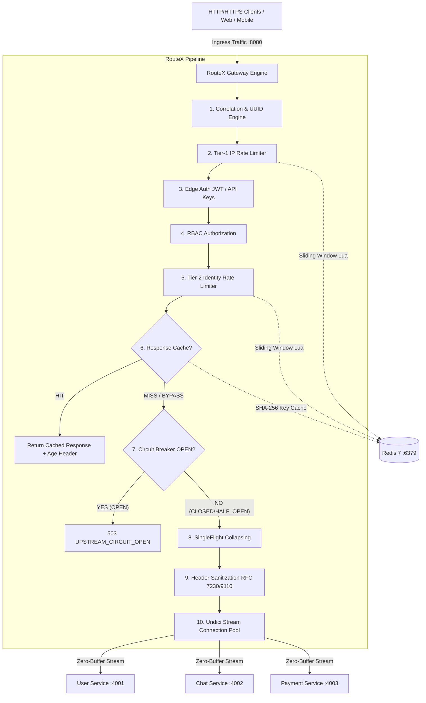
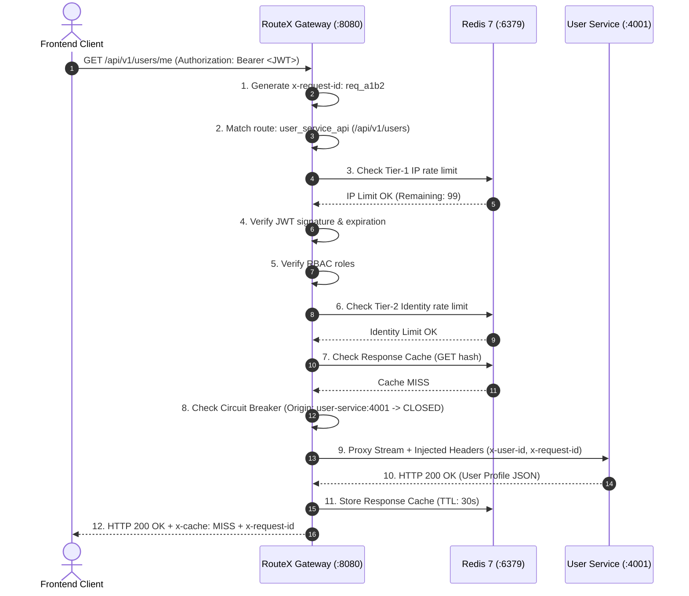

# RouteX — High-Performance Edge API Gateway & Reverse Proxy

> Production-quality, resilient, zero-buffer streaming API Gateway built with Node.js, TypeScript, Fastify, Undici, Redis, and Docker.

---

## Table of Contents
1. [Architecture Overview](#architecture-overview)
2. [Developer Prompts](#developer-prompts)
   - [Prompt 1 — Understand RouteX](#prompt-1--understand-routex)
   - [Prompt 2 — Integrate RouteX Into My Existing Project](#prompt-2--integrate-routex-into-my-existing-project)
3. [Integrating RouteX Into Your Application](#integrating-routex-into-your-application)
   - [The Integration Mental Model](#the-integration-mental-model)
   - [The Three Integration Models](#the-three-integration-models)
   - [Zero-to-Working Integration Guide (10 Steps)](#zero-to-working-integration-guide-10-steps)
   - [Real Worked Example Application](#real-worked-example-application)
   - [What the Developer Modifies vs What Stays Untouched](#what-the-developer-modifies-vs-what-stays-untouched)
   - [Docker Compose Integration: Same Stack vs External Services](#docker-compose-integration-same-stack-vs-external-services)
   - [Development vs Production Deployment](#development-vs-production-deployment)
   - [What Happens When My Application Sends a Request?](#what-happens-when-my-application-sends-a-request)
   - [Common Integration Mistakes & Gotchas](#common-integration-mistakes--gotchas)
   - [How to Add Another Backend Service](#how-to-add-another-backend-service)
   - [Client URLs vs Internal Upstream URLs](#client-urls-vs-internal-upstream-urls)
   - [Authentication & Identity Integration](#authentication--identity-integration)
   - [Practical Guide: Rate Limiting, Caching & Circuit Breaking](#practical-guide-rate-limiting-caching--circuit-breaking)
   - [RouteX Integration Checklist](#routex-integration-checklist)
   - [What You Don't Need to Change](#what-you-dont-need-to-change)
4. [Feature Matrix](#feature-matrix)
5. [Request Lifecycle Pipeline](#request-lifecycle-pipeline)
6. [Quickstart Guide](#quickstart-guide)
   - [Local Development](#local-development)
   - [Docker & Docker Compose](#docker--docker-compose)
7. [Configuration Reference](#configuration-reference)
8. [Operational Runbook](#operational-runbook)
   - [Health & Readiness Probes](#health--readiness-probes)
   - [Graceful Shutdown & Socket Draining](#graceful-shutdown--socket-draining)
   - [Structured Logging & Correlation](#structured-logging--correlation)
   - [Redis Fault Tolerance & Fail-Open Behavior](#redis-fault-tolerance--fail-open-behavior)
9. [Security Model](#security-model)
10. [Performance & Streaming Memory Profiling](#performance--streaming-memory-profiling)
11. [Troubleshooting Guide](#troubleshooting-guide)
12. [Automated Verification Suite](#automated-verification-suite)

---

## Architecture Overview


```mermaid
flowchart TD
    Client[HTTP/HTTPS Clients / Web / Mobile] -->|Ingress Traffic :8080| Gateway[RouteX Gateway Engine]
    
    subgraph RouteX Pipeline
        Gateway --> P1[1. Correlation & UUID Engine]
        P1 --> P2[2. Tier-1 IP Rate Limiter]
        P2 --> P3[3. Edge Auth JWT / API Keys]
        P3 --> P4[4. RBAC Authorization]
        P4 --> P5[5. Tier-2 Identity Rate Limiter]
        P5 --> P6{6. Response Cache?}
        
        P6 -- HIT --> CacheReturn[Return Cached Response + Age Header]
        P6 -- MISS / BYPASS --> P7{7. Circuit Breaker OPEN?}
        
        P7 -- YES (OPEN) --> FastFail[503 UPSTREAM_CIRCUIT_OPEN]
        P7 -- NO (CLOSED/HALF_OPEN) --> P8[8. SingleFlight Collapsing]
        P8 --> P9[9. Header Sanitization RFC 7230/9110]
        P9 --> P10[10. Undici Stream Connection Pool]
    end

    P10 -->|Zero-Buffer Stream| US1[User Service :4001]
    P10 -->|Zero-Buffer Stream| US2[Chat Service :4002]
    P10 -->|Zero-Buffer Stream| US3[Payment Service :4003]
    P2 -.->|Sliding Window Lua| Redis[(Redis 7 :6379)]
    P5 -.->|Sliding Window Lua| Redis
    P6 -.->|SHA-256 Key Cache| Redis
```

---

## Developer Prompts

The two prompts below are designed to be given directly to an AI coding agent.

**Prompt 1** makes the agent explain RouteX from first principles so you deeply understand what it does and why.

**Prompt 2** makes the agent inspect your existing project and perform the complete RouteX integration end-to-end — routes, Docker networking, environment variables, auth, Redis, frontend URLs, and verification.

---

## Prompt 1 — Understand RouteX

Give this prompt to an AI coding agent from **inside the RouteX repository**. The agent will inspect the actual source code and configuration files and build a complete mental model of RouteX that you can use for deep understanding and interview preparation.

```
You are a senior platform engineer and technical educator.

Your task is to produce a thorough, accurate mental model of the RouteX API Gateway project
by reading its actual source code, configuration files, and Docker setup.

Do not merely summarize file names or list features. Build and explain the mental model.
Use actual code, configuration, and schema definitions as your evidence.
Explicitly say when something cannot be confirmed from the repository.

---

INSPECT THE FOLLOWING FILES BEFORE EXPLAINING ANYTHING:

- src/config/schema.ts                    (Zod schema — all valid configuration fields)
- src/config/loader.ts                    (how config is loaded, env var precedence)
- src/server/gateway-server.ts            (Fastify server, full request pipeline)
- src/proxy/router.ts                     (route matching algorithm)
- src/proxy/pool.ts                       (Undici connection pool)
- src/proxy/stream-handler.ts             (streaming proxy)
- src/proxy/headers.ts                    (header sanitization, identity injection)
- src/proxy/websocket.ts                  (WebSocket proxy)
- src/proxy/upstream-health.ts            (upstream health tracking)
- src/auth/auth-manager.ts                (auth orchestration)
- src/auth/jwt-verifier.ts                (JWT verification logic)
- src/auth/api-key-authenticator.ts       (API key verification)
- src/auth/extractor.ts                   (credential extraction from headers)
- src/rate-limit/rate-limit-manager.ts    (two-tier rate limiting)
- src/cache/cache-manager.ts              (response caching, SingleFlight)
- src/circuit-breaker/circuit-manager.ts  (circuit breaker state machine)
- src/bin/gateway.ts                      (CLI entrypoint, graceful shutdown)
- config/gateway.docker.yaml              (actual gateway configuration)
- config/routes.docker.yaml               (actual route configuration)
- config/gateway.config.yaml              (local dev configuration)
- config/routes.yaml                      (local dev routes)
- docker-compose.yml                      (container topology)
- Dockerfile                              (multi-stage production build)
- .env.example                            (environment variables)
- package.json                            (npm scripts, dependencies, exports)

---

EXPLAIN THE FOLLOWING IN THIS EXACT ORDER:

1. ROUTEX IN ONE PICTURE
   Draw an ASCII diagram showing: Client -> RouteX -> Backend Services.
   Show Redis connected to RouteX.
   Explain what RouteX is in two sentences.
   Explain why an API Gateway exists — what problem it solves without one.

2. ONE HTTP REQUEST FROM CLIENT TO BACKEND
   Trace a single GET /api/v1/users/me request with Authorization: Bearer <JWT>
   through every stage from the moment it hits RouteX's socket to the moment
   the backend response reaches the client.
   Name every stage. Use actual code references.

3. EVERY STAGE OF THE REQUEST LIFECYCLE
   For each of the following stages, explain:
   - What happens
   - Why it happens at this point in the pipeline
   - What code/file implements it
   - What the failure mode is (what error/status code is returned)

   Stages:
   a. Correlation ID assignment (x-request-id, hrtime.bigint)
   b. Route resolution (longest-prefix matching, 404, 405)
   c. Tier-1 IP rate limiting (Redis Lua sliding window, 429, fail-open/fail-closed)
   d. Edge authentication (JWT HS256/RS256 verification, API key, mode: public/jwt/api-key/any, 401)
   e. RBAC authorization (requiredRoles, 403)
   f. Tier-2 identity rate limiting (per-user/API-key, tier overrides: free/premium, 429)
   g. Response cache lookup (SHA-256 cache key, query parameter sorting, GET-only, x-cache: HIT/MISS/BYPASS)
   h. Circuit breaker check (CLOSED/OPEN/HALF_OPEN, 503 UPSTREAM_CIRCUIT_OPEN)
   i. SingleFlight stampede protection (concurrent cache-miss coalescing)
   j. Header sanitization (hop-by-hop stripping RFC 7230/9110, CRLF neutralization, identity header stripping)
   k. Identity header injection (x-user-id, x-user-roles, x-auth-type, x-gateway-auth-status)
   l. Undici stream dispatch (connection pool, keep-alive, zero-buffer pipe)
   m. Circuit breaker feedback (onSuccess/onFailure by status code)
   n. Cache store (async, 200 OK only, maxBodyBytes)
   o. Access log emission (totalDurationMs, upstreamLatencyMs, gatewayOverheadMs)

4. WHAT EACH MAJOR COMPONENT DOES
   Explain: RouteXGatewayServer, ProxyRouter, UpstreamPoolManager,
   WebSocketProxyHandler, UpstreamHealthTracker, AuthManager, JwtVerifier,
   ApiKeyAuthenticator, RateLimitManager, CacheManager, CircuitManager,
   loadGatewayConfig.
   For each: what it is, what it owns, what calls it, what it calls.

5. WHY EACH COMPONENT EXISTS
   For each component, explain the specific problem it solves.
   Why Redis instead of in-memory? Why Undici instead of Node.js http?
   Why Fastify instead of Express? Why Zod for config?
   Why SingleFlight? Why per-origin circuit breakers?

6. FAILURE SCENARIOS
   For each failure, explain exactly what happens:
   a. Redis is unreachable (fail-open vs fail-closed behavior)
   b. Upstream service is down (502 BAD_GATEWAY, circuit breaker progression)
   c. Upstream is slow (504 GATEWAY_TIMEOUT, responseTimeoutMs)
   d. JWT is expired or tampered (401 UNAUTHORIZED)
   e. Client exceeds rate limit (429, Retry-After header)
   f. Circuit is OPEN (503 UPSTREAM_CIRCUIT_OPEN, fast-fail, no upstream call)
   g. Client disconnects mid-stream (backpressure, socket cleanup)
   h. SIGTERM received (graceful shutdown sequence, /readyz -> 503)
   i. Invalid YAML configuration (Zod validation error, process exit)

7. HOW REDIS PARTICIPATES
   Explain every Redis operation RouteX performs:
   - Sliding window Lua script for Tier-1 IP limiting
   - Sliding window Lua script for Tier-2 identity limiting
   - EVALSHA / NOSCRIPT fallback pattern
   - Response cache GET/SET with TTL
   - Cache key hashing (SHA-256, query parameter sorting)
   - Redis key prefix (routex:)
   - Redis fail-open vs fail-closed
   - Bounded exponential reconnect backoff
   - /readyz Redis PING check

8. HOW DOCKER NETWORKING WORKS
   Explain:
   - Why localhost does not work from within a Docker container to reach another container
   - How Docker Compose internal DNS resolves container service names
   - Why upstream values in routes.docker.yaml use http://user-service:4001 not http://localhost:4001
   - The routex-net bridge network in docker-compose.yml
   - How the gateway container resolves redis, user-service, chat-service
   - host.docker.internal for development
   - The difference between gateway.config.yaml (local dev) and gateway.docker.yaml (Docker)
   - The difference between routes.yaml (local dev) and routes.docker.yaml (Docker)
   - How ROUTEX_CONFIG_PATH and ROUTEX_ROUTES_PATH switch between environments

9. HOW AUTHENTICATION WORKS
   Cover each auth mode (public, jwt, api-key, any) including:
   - What credentials are required
   - Which file implements it
   - How the JWT is decoded (header, payload, signature — three base64url segments)
   - Cryptographic verification: HMAC-SHA256 for HS256, RSA-SHA256 for RS256
   - Why alg: none is always rejected
   - How exp, nbf, iss, aud, sub are validated
   - How roles are extracted (roles array or role string in JWT payload)
   - How RBAC works (requiredRoles: every role must be present)
   - How API keys are compared (crypto.timingSafeEqual, constant-time)
   - Which identity headers are injected into upstream requests
   - Which client headers are unconditionally stripped (security boundary)
   - What the anonymous auth context looks like on a public route

10. HOW RESILIENCE WORKS
    Explain:
    - Circuit breaker state machine: CLOSED -> OPEN -> HALF_OPEN -> CLOSED
    - What triggers OPEN (failureThreshold consecutive failures)
    - What failure status codes count (configurable: default 502, 503, 504)
    - HALF_OPEN probe behavior (halfOpenMaxRequests)
    - Per-origin isolation (one circuit per upstream URL)
    - How SingleFlight prevents stampede on cache miss
    - How fail-open rate limiting preserves availability during Redis downtime
    - How headersTimeoutMs > requestTimeoutMs prevents socket race conditions
    - How graceful shutdown preserves in-flight requests

11. HOW STREAMING WORKS
    Explain:
    - Why RouteX does not buffer full response bodies before forwarding
    - How Undici streams response directly to client socket
    - What backpressure means in this context
    - Why heap growth is bounded regardless of response payload size
    - The exception: when caching is enabled (body is buffered up to maxBodyBytes)
    - How request upload bodies are also streamed upstream
    - How WebSocket proxying works (RFC 6455 upgrade, tunnel)
    - Connection pool keep-alive behavior

12. HOW THE ENTIRE ARCHITECTURE FITS TOGETHER
    Draw a full ASCII architecture diagram:
    Client -> RouteX (Fastify + pipeline) -> Undici pool -> Upstream services
                         |                        ^
                         v                        |
                       Redis              Circuit Breaker / Cache
    Then explain how each component depends on the others.
    Explain the startup sequence.
    Explain the shutdown sequence.
    Explain what a developer must provide and what RouteX provides.

---

INTERVIEW PREPARATION

After the technical explanation, provide clear, accurate answers to these questions
that a developer who built RouteX should be able to answer:

- What is RouteX?
- Why did you build a gateway instead of implementing these features in every service?
- How does the request flow?
- Why Redis?
- Why Undici instead of Node.js built-in HTTP?
- How does rate limiting work?
- How does the circuit breaker work?
- How do you prevent header spoofing?
- How does streaming avoid full-payload buffering?
- What happens when Redis goes down?
- What happens when an upstream service goes down?
- What happens when the client disconnects mid-stream?
- How does the gateway scale?
- What is SingleFlight and why does it matter?
- How does authentication work without a database lookup?
- How does the gateway enforce RBAC?
- What is the difference between Tier-1 and Tier-2 rate limiting?
- How does the cache key prevent query parameter order from causing cache misses?
- How does graceful shutdown work?
- What does /readyz check that /livez does not?

For every answer, cite the specific file and function where the behavior is implemented.
```

---

## Prompt 2 — Integrate RouteX Into My Existing Project

Give this prompt to an AI coding agent from **inside your existing application's repository**. The agent will inspect your project, design the integration, modify the configuration, connect Docker networking, configure authentication, update your frontend, verify the result, and fix any problems it encounters.

The agent should perform all changes autonomously. You should not need to manually edit any configuration file.

```
You are a senior platform engineer and implementation agent.

Your task is to integrate the RouteX API Gateway into this existing application.
RouteX is a production-grade Node.js/TypeScript API Gateway and reverse proxy.
Repository: https://github.com/ankit18193/RouteX

You must behave like an implementation engineer, not a documentation assistant.
Do not tell the developer what to change. Actually inspect and modify the project.
Do not stop after generating configuration. Build, start, test, fix, and verify.
Do not leave the application in a broken intermediate state.
Do not claim success without actually verifying it.

---

PHASE A — UNDERSTAND THE EXISTING APPLICATION

Inspect the entire project before making any changes.

Identify and document:
- Frontend applications (React, Vue, Next.js, etc.) and their API base URL configuration
- Backend services: names, ports, entrypoints, frameworks
- All API routes exposed by each backend service
- WebSocket endpoints (if any)
- package.json files, npm scripts, and start commands
- Dockerfiles and docker-compose.yml files
- Existing environment files (.env, .env.example, .env.local, etc.)
- Authentication implementation: JWT issuer, secret/key, algorithm, claims structure, roles
- Existing API keys (if used)
- Existing Redis (if present)
- Internal service-to-service communication patterns
- Existing reverse proxies (Nginx, Caddy, etc.)
- Database connections

Build a clear architecture map. Output it before proceeding.
Do not modify anything in Phase A.

---

PHASE B — INSPECT ROUTEX

Locate RouteX in this repository, or clone it alongside this project:
  git clone https://github.com/ankit18193/RouteX.git

Inspect these RouteX files before configuring anything:
- src/config/schema.ts          (all valid configuration fields and constraints)
- config/gateway.docker.yaml    (gateway config structure)
- config/routes.docker.yaml     (route config structure)
- config/gateway.config.yaml    (local dev structure)
- config/routes.yaml            (local dev routes)
- .env.example                  (required environment variables)
- docker-compose.yml            (container topology)
- package.json                  (available npm scripts)

Only use configuration fields that actually exist in src/config/schema.ts.
Do not invent route fields, gateway fields, or environment variables.

Key RouteX facts to confirm from the schema:
- Auth modes: public, jwt, api-key, any
- Rate limit failure policies: fail-open, fail-closed
- Circuit breaker fields: failureThreshold, resetTimeoutMs, halfOpenMaxRequests, failureStatusCodes
- Cache fields: enabled, ttlSec, maxBodyBytes, varyBy, allowAuthenticated, respectCacheControl
- Timeout fields: connectTimeoutMs, responseTimeoutMs
- Either upstream (single) or upstreams (array) must be provided per route
- Environment variables that RouteX reads: PORT, HOST, LOG_LEVEL, LOG_FORMAT,
  ROUTEX_CONFIG_PATH, ROUTEX_ROUTES_PATH, REDIS_HOST, REDIS_PORT,
  REDIS_PASSWORD, JWT_HS256_SECRET
- Health endpoints: /livez (liveness), /readyz (readiness + Redis ping), /healthz (liveness alias)
- Default gateway port: 8080
- Docker service name for Redis in docker-compose: redis
- Docker network name: routex-net

---

PHASE C — DESIGN THE INTEGRATION

Using the application's real service names, ports, and routes:

1. Create a routing map:
   /api/<path> -> http://<container-name>:<port>
   Use the application's actual container names and ports.
   Do not invent names or ports.

2. Decide authentication mode per route:
   - Public endpoints (login, signup, health): mode: public
   - JWT-protected endpoints: mode: jwt
   - Admin endpoints: mode: jwt with requiredRoles
   - API key endpoints: mode: api-key
   Base this on the application's EXISTING authentication implementation.

3. Decide which routes need:
   - Rate limiting (all public endpoints minimum)
   - Caching (safe GET endpoints with low change frequency)
   - Circuit breakers (all production upstream routes)
   - Timeout values (based on expected upstream latency)

4. If WebSocket endpoints exist, determine if they should route through RouteX.
   RouteX supports WebSocket proxying only when websocket: true is set on a route.
   Only configure this if it is actually needed and supported.

5. Determine whether the frontend's API base URL needs to change.
   If frontend currently calls http://localhost:<port> directly,
   it should call http://localhost:8080 (RouteX) after integration.

Document the complete integration design before proceeding.

---

PHASE D — MODIFY ROUTEX CONFIGURATION

Edit config/routes.docker.yaml with all routes for the application.

For each route, include only schema-valid fields:
  id: unique_route_id
  pathPrefix: /api/v1/resource
  upstream: http://<container-name>:<port>
  stripPrefix: false
  methods: [GET, POST, PUT, PATCH, DELETE]
  auth:
    mode: public|jwt|api-key|any
    requiredRoles: []
  rateLimit:
    enabled: true
    windowSec: 60
    limit: 100
    failurePolicy: fail-open
  cache:
    enabled: false
  circuitBreaker:
    enabled: true
    failureThreshold: 5
    resetTimeoutMs: 10000
    halfOpenMaxRequests: 2
    failureStatusCodes: [500, 502, 503, 504]
  timeouts:
    connectTimeoutMs: 2000
    responseTimeoutMs: 5000

Edit config/gateway.docker.yaml if needed (timeouts, trusted proxies, log level).
Do not hardcode JWT secrets in YAML. Use hs256SecretEnv: JWT_HS256_SECRET instead.

---

PHASE E — MODIFY DOCKER CONFIGURATION

If the application uses Docker Compose:

1. Add RouteX to docker-compose.yml:
   routex-gateway:
     build:
       context: ./RouteX
       dockerfile: Dockerfile
     container_name: routex-gateway
     restart: unless-stopped
     environment:
       - PORT=8080
       - HOST=0.0.0.0
       - REDIS_HOST=redis
       - REDIS_PORT=6379
       - ROUTEX_CONFIG_PATH=config/gateway.docker.yaml
       - ROUTEX_ROUTES_PATH=config/routes.docker.yaml
       - LOG_LEVEL=info
       - LOG_FORMAT=json
     ports:
       - "8080:8080"
     depends_on:
       redis:
         condition: service_healthy
     healthcheck:
       test: ["CMD", "wget", "--no-verbose", "--tries=1", "--spider", "http://127.0.0.1:8080/livez"]
       interval: 5s
       timeout: 3s
       retries: 5
     networks:
       - <application-network>

2. If Redis does not already exist in docker-compose.yml, add it:
   redis:
     image: redis:7-alpine
     container_name: routex-redis
     restart: unless-stopped
     healthcheck:
       test: ["CMD", "redis-cli", "ping"]
       interval: 5s
       timeout: 3s
       retries: 5
     networks:
       - <application-network>

3. Ensure RouteX is on the same Docker network as all backend services it routes to.
   Use the application's existing network name, not a new one.

4. CRITICAL: Never use localhost as an upstream URL inside Docker.
   Always use the Docker service name: http://user-service:4001

5. Do not expose backend service ports externally if they should only be
   accessible via RouteX. Remove or restrict host port mappings where appropriate.

6. Do not break any existing services.

---

PHASE F — ENVIRONMENT CONFIGURATION

Inspect the application's .env.example or equivalent.

Add ONLY these RouteX variables (confirm each exists in RouteX's actual implementation):

  # RouteX Gateway
  ROUTEX_CONFIG_PATH=config/gateway.docker.yaml
  ROUTEX_ROUTES_PATH=config/routes.docker.yaml
  REDIS_HOST=redis
  REDIS_PORT=6379
  REDIS_PASSWORD=
  JWT_HS256_SECRET=<use-the-application-existing-jwt-secret-or-a-strong-placeholder>

Update .env.example (or equivalent template). Do not commit real secrets.
Do not overwrite existing environment variables.
If the application already defines REDIS_HOST or JWT_SECRET, reconcile carefully.

---

PHASE G — AUTHENTICATION INTEGRATION

Inspect the existing authentication implementation:
- What JWT library does the application use?
- What algorithm (HS256, RS256)?
- What is the secret or public key?
- What claims does the token carry (sub, roles, tier, exp, iss, aud)?
- What is the token lifetime?

Configure RouteX's gateway.docker.yaml auth section to match:
  auth:
    jwt:
      enabled: true
      algorithms: ["HS256"]       # match the application's algorithm
      hs256SecretEnv: JWT_HS256_SECRET   # env var, not inline secret
      issuer: "..."               # match application's iss claim (if set)
      audience: "..."             # match application's aud claim (if set)

Note: RouteX extracts user identity from JWT claims:
  - sub -> x-user-id
  - roles or role -> x-user-roles
  - tier -> used for rate limit tier selection

Ensure the application's JWT tokens include a sub claim.
If not, document the gap clearly and do not force a change without developer approval.

Route-level auth: configure routes in routes.docker.yaml accordingly:
  - Login / signup / health -> mode: public
  - User-facing authenticated routes -> mode: jwt
  - Admin routes -> mode: jwt + requiredRoles: ["admin"]
  - API key routes -> mode: api-key

Verify that the following headers will be stripped from client requests and
injected with verified values by RouteX before upstream dispatch:
  x-user-id, x-user-roles, x-auth-type, x-gateway-auth-status

If backend services currently read x-user-id from requests, they should continue
to do so — RouteX will inject the verified value. No changes to backend services
are needed unless they previously trusted client-supplied headers.

---

PHASE H — FRONTEND INTEGRATION

Locate frontend API configuration:
- Environment files (.env, .env.local, config files)
- API base URL constants
- Axios/fetch base URL configuration
- API client setup files

If the frontend currently calls backend services directly on port 4001, 4002, etc.:
Update API_BASE_URL (or equivalent) to http://localhost:8080 (RouteX).

If the frontend is in Docker and calls backend containers directly:
Update to http://routex-gateway:8080 (or the correct container name).

Do not blindly replace all URLs. Understand which requests go to which service
and confirm the corresponding route is configured in routes.docker.yaml.

---

PHASE I — REDIS INTEGRATION

Determine whether the application already uses Redis:

- If yes: check whether RouteX can share it safely.
  RouteX uses key prefix routex: by default (configurable in gateway.docker.yaml).
  If the application uses different key namespaces, sharing is safe.
  If key conflicts are possible, use a dedicated Redis instance for RouteX.

- If no: add redis:7-alpine to docker-compose.yml as described in Phase E.

Set REDIS_HOST and REDIS_PORT in the environment to point to the correct instance.
If Redis requires a password, set REDIS_PASSWORD.

---

PHASE J — START THE SYSTEM

Using the project's actual commands:

1. If Docker Compose is the deployment mechanism:
   docker compose up --build -d

2. If the project uses separate start scripts:
   Check package.json for the correct start commands.
   Start Redis, then RouteX, then verify with health probes.

Do not assume commands. Read package.json and Docker configuration first.

---

PHASE K — VERIFY THE INTEGRATION

Do not stop after modifying configuration. Actually verify.

Run each of the following checks and report the result:

1. docker compose ps
   -> All containers showing Up (healthy)

2. curl -s http://localhost:8080/livez | jq
   -> status: ok

3. curl -s http://localhost:8080/readyz | jq
   -> status: ok, redis: ok

4. Test a public route (no auth required):
   curl -i http://localhost:8080/<public-endpoint>
   -> 200 OK, x-request-id header present

5. Test a JWT-protected route without a token:
   curl -i http://localhost:8080/<protected-endpoint>
   -> 401 Unauthorized

6. Test a JWT-protected route with a valid token:
   curl -i -H "Authorization: Bearer <valid-token>" http://localhost:8080/<protected-endpoint>
   -> 200 OK, x-ratelimit-limit header present

7. Test with an expired or tampered JWT:
   -> 401 Unauthorized

8. Test rate limiting by sending rapid requests:
   -> 429 Too Many Requests on limit breach, x-ratelimit-remaining in headers

9. Test cache (if enabled on a route):
   First request: X-Cache: MISS
   Second request (same URL within TTL): X-Cache: HIT

10. Check backend service logs to verify:
    - x-user-id header is present on authenticated requests
    - x-gateway-forwarded-by: routex header is present
    - x-request-id matches the id in the client response

11. Verify the frontend can reach its API via RouteX.
    Load the frontend and perform an authenticated action.
    Confirm the action succeeds end-to-end.

12. Verify that existing functionality not routed through RouteX is unaffected.

---

PHASE L — FIX PROBLEMS AUTONOMOUSLY

If any verification step fails:

1. Run docker compose logs <service-name> to identify the root cause.
2. Fix the configuration or integration issue.
3. Restart affected services: docker compose restart <service-name>
4. Re-run the failed verification step.
5. Continue until all checks pass.

Common issues to diagnose:
- 502 BAD_GATEWAY: upstream URL uses localhost instead of container service name
- 401 UNAUTHORIZED: JWT secret mismatch between application and RouteX
- redis: down in /readyz: REDIS_HOST not set to the correct service name
- Route not matching: pathPrefix wrong or trailing slash present
- Container not on correct network: run docker network inspect <network>

Do not ask the developer to manually fix something if you can fix it yourself.
Do not leave the application in a broken intermediate state.

---

PHASE M — FINAL SECURITY REVIEW

Before finishing, verify:

- .env is in .gitignore and not committed
- No real secrets appear in YAML configuration files or docker-compose.yml
- JWT_HS256_SECRET is set only in .env (not in gateway.docker.yaml inline)
- Internal backend services are not unnecessarily exposed on host ports
- Redis is not publicly exposed unless required
- trustedProxies in gateway.docker.yaml includes only your actual load balancer CIDRs
- requiredRoles is configured on admin/privileged routes
- cache.allowAuthenticated is only true where intentional data sharing is acceptable
- failurePolicy on login/payment routes is fail-closed where strict quotas are needed

---

PHASE N — FINAL REPORT

Provide a structured report:

1. Original application architecture (before RouteX)
2. New architecture with RouteX (ASCII diagram)
3. Files changed and what was changed in each
4. Route configuration summary (id, pathPrefix, upstream, auth mode per route)
5. Authentication integration summary
6. Redis integration summary
7. Docker changes summary
8. Frontend changes summary
9. Commands used to start the system
10. Verification results (pass/fail per check)
11. Any limitations or manual steps still required (with clear explanation of why)

End with the final architecture diagram:

  Client / Frontend
          |
          v
     RouteX Gateway :8080
          |
     +----+----+----+
     |         |    |
     v         v    v
  Service A  Srv B  Srv C
     |               |
     v               v
  Database          Redis

And conclude with:
  RouteX is now integrated as the application's API gateway layer.
```

---

## Integrating RouteX Into Your Application

This section is a step-by-step, practical guide for developers who want to connect RouteX to their existing backend services and direct frontend/client traffic through the gateway.

### The Integration Mental Model

RouteX is an **Edge API Gateway and Reverse Proxy**. It acts as a single, hardened entry point in front of your backend microservices:

```
BEFORE ROUTEX:
Client / Frontend ───> Directly calls User Service (:4001)
                  ───> Directly calls Chat Service (:4002)
                  ───> Directly calls Payment Service (:4003)

AFTER ROUTEX:
Client / Frontend ───> RouteX Gateway (:8080)
                              │
                              ├───> User Service (:4001)
                              ├───> Chat Service (:4002)
                              └───> Payment Service (:4003)
```

- **Your backend services stay untouched**: Your services continue to execute business logic, query databases, and return responses. You **do not** rewrite your APIs to use RouteX.
- **RouteX handles cross-cutting concerns**: RouteX centralizes routing, authentication (JWT/API-keys), role-based access control (RBAC), distributed sliding-window rate limiting, HTTP response caching, circuit breaking, zero-buffer streaming, and RFC 7230/9110 header hygiene.
- **Trusted identity propagation**: Once RouteX authenticates a user, it injects verified HTTP headers (`x-user-id`, `x-user-roles`, `x-auth-type`) into the upstream request. Your downstream services can trust these headers and avoid redundant JWT decoding.

---

### The Three Integration Models

Depending on your organization's repository structure, choose the model that fits your architecture:

#### Option A: Dedicated Gateway Service (Recommended for Microservices)

RouteX runs as an independent repository and containerized service in your infrastructure, sitting in front of your application services:

```
my-application/
  ├── frontend/
  ├── user-service/
  ├── chat-service/
  └── payment-service/

RouteX/ (Separate repo / container)
  ├── config/
  │   ├── gateway.docker.yaml
  │   └── routes.docker.yaml
  └── docker-compose.yml
```

#### Option B: Monorepo / Unified Deployment

If your team maintains a monorepo, RouteX lives in an `api-gateway/` or `routex/` directory and is orchestrated alongside your services in a shared `docker-compose.yml` or Kubernetes manifest.

#### Option C: Reusable npm Package / Programmatic Library

Install and import RouteX directly into any Node.js / TypeScript application:

```bash
npm install routex
```

```typescript
import { createGatewayServer } from 'routex';

// Initialize RouteX Gateway programmatically in code
const gateway = createGatewayServer({
  server: {
    port: 8080,
    host: '0.0.0.0',
    logLevel: 'info',
  },
  routes: [
    {
      id: 'user-service-route',
      pathPrefix: '/api/v1/users',
      upstream: 'http://localhost:4001',
      methods: ['GET', 'POST', 'PUT', 'DELETE'],
    },
    {
      id: 'chat-service-route',
      pathPrefix: '/api/v1/chats',
      upstream: 'http://localhost:4002',
      websocket: true,
    },
  ],
});

// Start listening
const address = await gateway.listen();
console.log(`RouteX Gateway running on ${address}`);

// Access underlying Fastify instance if needed:
// gateway.fastifyInstance.get('/custom', ...)

// Gracefully drain sockets and close connection pools on shutdown:
// await gateway.close();
```

##### Modular Subpath Imports

RouteX exports clean, tree-shakeable ESM submodules:

```typescript
import { RouteXGatewayServer, createGatewayServer } from 'routex/server';
import { GatewayConfigSchema, loadGatewayConfig } from 'routex/config';
import { GatewayError, createErrorEnvelope } from 'routex/errors';
import { AuthManager, createAuthManager } from 'routex/auth';
import { RateLimitManager, RedisClient } from 'routex/rate-limit';
import { CacheManager } from 'routex/cache';
import { CircuitManager } from 'routex/circuit-breaker';
import { ProxyRouter, WebSocketProxyHandler } from 'routex/proxy';
import { createLogger, logAccess } from 'routex/logger';
```

---

### Zero-to-Working Integration Guide (10 Steps)

Follow these 10 steps to connect RouteX to your backend services:

#### Step 1 — Get RouteX

Clone the RouteX repository:

```bash
git clone https://github.com/ankit18193/RouteX.git
cd RouteX
```

You do **not** copy RouteX TypeScript source files into your backend application. RouteX is a standalone service packaged via Docker.

#### Step 2 — Identify Your Backend Services

List the URLs and ports of the backend services you want to place behind RouteX:

| Service Name | Internal Host & Port | Example Routes |
|---|---|---|
| **User Service** | `http://user-service:4001` | `/api/v1/users/*`, `/api/v1/auth/*` |
| **Chat Service** | `http://chat-service:4002` | `/api/v1/chats/*`, `/api/v1/messages/*` |
| **Payment Service** | `http://payment-service:4003` | `/api/v1/payments/*` |

*(Replace these with your actual container names/hostnames and ports).*

#### Step 3 — Configure Routes in `config/routes.docker.yaml`

Edit [`config/routes.docker.yaml`](file:///d:/RouteX/RouteX/config/routes.docker.yaml) to register your routes and upstream targets:

```yaml
routes:
  # 1. Public Authentication Route
  - id: auth_service_api
    pathPrefix: /api/v1/auth
    upstream: http://user-service:4001
    stripPrefix: false
    methods: [POST]
    auth:
      mode: public
    rateLimit:
      enabled: true
      windowSec: 60
      limit: 30
      failurePolicy: fail-open
    timeouts:
      connectTimeoutMs: 2000
      responseTimeoutMs: 3000

  # 2. Protected User Management Route
  - id: user_service_api
    pathPrefix: /api/v1/users
    upstream: http://user-service:4001
    stripPrefix: false
    methods: [GET, POST, PUT, PATCH, DELETE]
    auth:
      mode: jwt
      requiredRoles: []
    rateLimit:
      enabled: true
      windowSec: 60
      limit: 100
      tiers:
        free: 60
        premium: 500
    cache:
      enabled: true
      ttlSec: 30
      allowAuthenticated: true
    circuitBreaker:
      enabled: true
      failureThreshold: 5
      resetTimeoutMs: 10000
    timeouts:
      connectTimeoutMs: 2000
      responseTimeoutMs: 5000

  # 3. Chat & Messaging Route
  - id: chat_service_api
    pathPrefix: /api/v1/chats
    upstream: http://chat-service:4002
    stripPrefix: false
    methods: [GET, POST, PUT, DELETE]
    auth:
      mode: any
    rateLimit:
      enabled: true
      windowSec: 60
      limit: 120
    timeouts:
      connectTimeoutMs: 2000
      responseTimeoutMs: 5000
```

##### Field Reference for `routes.docker.yaml`:

| Field | Type | Description |
|---|---|---|
| `id` | `string` | Unique identifier for the route (e.g. `user_service_api`). |
| `pathPrefix` | `string` | URL prefix matched using longest-prefix matching (e.g. `/api/v1/users`). |
| `upstream` | `string` | Internal upstream URL (e.g. `http://user-service:4001`). Must include protocol. |
| `stripPrefix` | `boolean` | `false` preserves `pathPrefix` when proxying; `true` strips it before dispatching. |
| `methods` | `string[]` | HTTP methods allowed (e.g. `[GET, POST, PUT, DELETE]`). Unmatched methods return 405. |
| `auth.mode` | `enum` | `'public'` (no auth), `'jwt'` (Bearer token), `'api-key'` (`x-api-key`), `'any'` (JWT or API key). |
| `auth.requiredRoles` | `string[]` | RBAC roles required to access route (e.g. `['admin']`). |
| `rateLimit.enabled` | `boolean` | Activates Redis atomic sliding-window rate limiting. |
| `rateLimit.windowSec` | `number` | Rate limit window in seconds (default: `60`). |
| `rateLimit.limit` | `number` | Allowed request quota per window (default: `100`). |
| `rateLimit.tiers` | `record` | Tier-based quotas based on user/API-key tier (e.g. `free: 60`, `premium: 500`). |
| `cache.enabled` | `boolean` | Activates Redis response caching for safe GET requests. |
| `cache.ttlSec` | `number` | Time-to-live for cached responses in seconds. |
| `circuitBreaker.enabled` | `boolean` | Activates per-upstream circuit breaker protection. |
| `circuitBreaker.failureThreshold` | `number` | Consecutive 5xx failures required to trip breaker to `OPEN`. |
| `timeouts.responseTimeoutMs` | `number` | Maximum time to wait for upstream response before returning 504. |

#### Step 4 — Configure Gateway Settings in `config/gateway.docker.yaml`

Review [`config/gateway.docker.yaml`](file:///d:/RouteX/RouteX/config/gateway.docker.yaml):

```yaml
server:
  port: 8080
  host: 0.0.0.0
  requestTimeoutMs: 10000
  headersTimeoutMs: 11000
  maxHeaderSize: 16384
  trustedProxies:
    - 127.0.0.1
    - ::1
    - 172.16.0.0/12
    - 10.0.0.0/8
  logLevel: info
  logFormat: json

redis:
  host: redis
  port: 6379
  db: 0
  connectTimeoutMs: 3000
  keyPrefix: "routex:"

auth:
  jwt:
    enabled: true
    hs256Secret: "routex-dev-super-secret-key-for-testing-at-least-32-chars-long!"
  apiKey:
    enabled: true
    headerName: "x-api-key"
    cacheTtlSec: 300
```

#### Step 5 — Configure Environment Variables in `.env`

Copy `.env.example` to `.env`:

```bash
cp .env.example .env
```

Review `.env`:

```ini
# Server configuration
PORT=8080
HOST=0.0.0.0
LOG_LEVEL=info
LOG_FORMAT=json

# Configuration file paths (points to Docker configuration)
ROUTEX_CONFIG_PATH=config/gateway.docker.yaml
ROUTEX_ROUTES_PATH=config/routes.docker.yaml

# Redis configuration (inside Docker Compose, host is the service name 'redis')
REDIS_HOST=redis
REDIS_PORT=6379
REDIS_PASSWORD=

# Authentication secrets (Replace with your production secrets)
JWT_HS256_SECRET=your-32-character-or-longer-production-jwt-secret-key-here!
JWT_SECRET=your-32-character-or-longer-production-jwt-secret-key-here!
```

> [!IMPORTANT]
> Never commit `.env` to version control. The repository `.gitignore` automatically ignores `.env`. Use `.env.example` as a template.

#### Step 6 — Configure Docker Networking (`service-name` vs `localhost`)

When running inside Docker Compose:
- **CORRECT**: `upstream: http://user-service:4001` (Uses Docker internal DNS to resolve the container name).
- **INCORRECT**: `upstream: http://localhost:4001` (Resolves to the `routex-gateway` container itself, causing connection refused `502 BAD_GATEWAY`).

Ensure your services share a Docker network with RouteX (e.g. `routex-net`).

#### Step 7 — Start RouteX with Docker Compose

Build and launch the stack:

```bash
# Build the production Docker image
docker compose build

# Start the stack in background
docker compose up -d

# Check running container health
docker compose ps
```

Expected output:
```text
NAME                  SERVICE          STATUS                    PORTS
routex-gateway        routex-gateway   Up 2 minutes (healthy)    0.0.0.0:8080->8080/tcp
routex-redis          redis            Up 2 minutes (healthy)    0.0.0.0:6379->6379/tcp
routex-user-service   user-service     Up 2 minutes (healthy)    0.0.0.0:4001->4001/tcp
routex-chat-service   chat-service     Up 2 minutes (healthy)    0.0.0.0:4002->4002/tcp
```

#### Step 8 — Verify the Gateway Probes

Verify that RouteX and its dependencies are running and healthy:

```bash
# Liveness Probe (process health, memory usage)
curl -i http://localhost:8080/livez

# Readiness Probe (router, poolManager, Redis connectivity)
curl -i http://localhost:8080/readyz
```

Expected response for `/readyz`:
```json
{
  "status": "ok",
  "gateway": "RouteX",
  "checks": {
    "router": "ok",
    "poolManager": "ok",
    "redis": "ok"
  },
  "uptimeSec": 120
}
```

#### Step 9 — Change Your Client / Frontend Base URL

Update your frontend application (React, Vue, iOS, Android, etc.) or API client to send traffic through RouteX at port `8080`:

```javascript
// BEFORE: Directly contacting microservices
const USER_API = "http://localhost:4001/api/v1/users";
const CHAT_API = "http://localhost:4002/api/v1/chats";

// AFTER: All ingress traffic routes through RouteX Gateway
const API_BASE_URL = "http://localhost:8080";

// Fetch current user
const userRes = await fetch(`${API_BASE_URL}/api/v1/users/me`, {
  headers: { "Authorization": `Bearer ${token}` }
});

// Fetch chats
const chatRes = await fetch(`${API_BASE_URL}/api/v1/chats`, {
  headers: { "Authorization": `Bearer ${token}` }
});
```

#### Step 10 — Test Authentication & Trusted Identity Propagation

Send an authenticated request through RouteX:

```bash
# 1. Obtain a JWT token
TOKEN=$(curl -s -X POST http://localhost:8080/api/v1/auth/token \
  -H "Content-Type: application/json" \
  -d '{"sub":"usr_prod_101","roles":["user"]}' | jq -r .token)

# 2. Call protected user route through RouteX Gateway
curl -i -H "Authorization: Bearer $TOKEN" http://localhost:8080/api/v1/users/me
```

RouteX validates the JWT, enforces rate limits, checks RBAC, and injects verified identity headers before forwarding to `user-service`:
- `x-user-id: usr_prod_101`
- `x-user-roles: user`
- `x-auth-type: jwt`
- `x-gateway-auth-status: authenticated`

---

### Real Worked Example Application

Let's look at an end-to-end request flow for a realistic 3-service architecture:


```mermaid
sequenceDiagram
    autonumber
    actor Client as Frontend Client
    participant GW as RouteX Gateway (:8080)
    participant Redis as Redis 7 (:6379)
    participant US as User Service (:4001)

    Client->>GW: GET /api/v1/users/me (Authorization: Bearer <JWT>)
    GW->>GW: 1. Generate x-request-id: req_a1b2
    GW->>GW: 2. Match route: user_service_api (/api/v1/users)
    GW->>Redis: 3. Check Tier-1 IP rate limit
    Redis-->>GW: IP Limit OK (Remaining: 99)
    GW->>GW: 4. Verify JWT signature & expiration
    GW->>GW: 5. Verify RBAC roles
    GW->>Redis: 6. Check Tier-2 Identity rate limit
    Redis-->>GW: Identity Limit OK
    GW->>Redis: 7. Check Response Cache (GET hash)
    Redis-->>GW: Cache MISS
    GW->>GW: 8. Check Circuit Breaker (Origin: user-service:4001 -> CLOSED)
    GW->>US: 9. Proxy Stream + Injected Headers (x-user-id, x-request-id)
    US-->>GW: 10. HTTP 200 OK (User Profile JSON)
    GW->>Redis: 11. Store Response Cache (TTL: 30s)
    GW-->>Client: 12. HTTP 200 OK + x-cache: MISS + x-request-id
```

---

### What the Developer Modifies vs What Stays Untouched

| File / Component | Modification Required? | Purpose & Developer Responsibility |
|---|:---:|---|
| [`config/routes.docker.yaml`](file:///d:/RouteX/RouteX/config/routes.docker.yaml) | **REQUIRED** | Declare your backend services, URL paths, auth requirements, rate limits, caching, and timeouts. |
| [`.env`](file:///d:/RouteX/RouteX/.env) | **REQUIRED** | Set environment-specific secrets (`JWT_HS256_SECRET`, `REDIS_HOST`, `PORT`). |
| [`config/gateway.docker.yaml`](file:///d:/RouteX/RouteX/config/gateway.docker.yaml) | **OPTIONAL** | Adjust global server timeouts, trusted proxy CIDRs, and logging level/format. |
| [`docker-compose.yml`](file:///d:/RouteX/RouteX/docker-compose.yml) | **OPTIONAL** | Replace mock services with your actual application containers or attach external networks. |
| [`Dockerfile`](file:///d:/RouteX/RouteX/Dockerfile) | **DO NOT TOUCH** | Production multi-stage Alpine build already configured and optimized. |
| `src/**` (All source code) | **DO NOT TOUCH** | Core gateway routing, streaming, crypto, and Redis Lua engines. |
| [`.env.example`](file:///d:/RouteX/RouteX/.env.example) | **REFERENCE ONLY** | Template for `.env`. Keep in sync if new environment variables are introduced. |

---

### Docker Compose Integration: Same Stack vs External Services

#### Case 1: Services in the Same `docker-compose.yml`

If your backend services run in the same Compose stack as RouteX:

```yaml
services:
  routex-gateway:
    build: .
    container_name: routex-gateway
    ports:
      - "8080:8080"
    environment:
      - REDIS_HOST=redis
      - ROUTEX_CONFIG_PATH=config/gateway.docker.yaml
      - ROUTEX_ROUTES_PATH=config/routes.docker.yaml
    networks:
      - app-net

  redis:
    image: redis:7-alpine
    container_name: routex-redis
    networks:
      - app-net

  my-user-service:
    image: my-org/user-service:latest
    container_name: my-user-service
    networks:
      - app-net
```

In `config/routes.docker.yaml`, set:
```yaml
upstream: http://my-user-service:4001
```

#### Case 2: Services on an External Docker Network or Host

If your backend services are running in a separate Compose project or on the host machine:

1. **Connect to an external Docker network**:
   ```yaml
   networks:
     routex-net:
       external: true
       name: my-existing-backend-network
   ```
2. **Or access the host machine from Docker (Development only)**:
   ```yaml
   # In routes.docker.yaml (Windows / macOS Docker Desktop):
   upstream: http://host.docker.internal:4001
   ```

---

### Development vs Production Deployment

| Consideration | Local Development | Cloud Production (Kubernetes / AWS ECS / VMs) |
|---|---|---|
| **Orchestration** | `docker compose up -d` | Kubernetes Deployment / ECS Task Definition / Docker Swarm |
| **Ingress Point** | `http://localhost:8080` | Cloud Load Balancer (AWS ALB, Cloudflare, NGINX Ingress) |
| **Redis** | Local container (`redis:7-alpine`) | Managed Redis Cluster (AWS ElastiCache, Redis Enterprise) |
| **Secrets** | Local `.env` file | AWS Secrets Manager, HashiCorp Vault, Kubernetes Secrets |
| **Health Checks** | Compose `healthcheck` on `/livez` | K8s Liveness (`/livez`) & Readiness (`/readyz`) probes |

---

### What Happens When My Application Sends a Request?

When a client makes a request to `GET http://localhost:8080/api/v1/users/me`:

1. **Correlation**: RouteX reads or generates `x-request-id` (e.g. `req_70b57b88-e765-406a...`) and initializes high-resolution nanosecond timers.
2. **Route Resolution**: Matches `/api/v1/users/me` to the `user_service_api` route definition.
3. **Tier-1 IP Rate Limiting**: Evaluates client IP quota in Redis. Rejects with 429 if the IP exceeded its limit.
4. **Edge Authentication**: Validates the `Authorization: Bearer <JWT>` header using cryptographic signature verification (HS256/RS256). Rejects with 401 if missing, expired, or tampered.
5. **RBAC Authorization**: Checks if user's roles satisfy the route's `requiredRoles`. Rejects with 403 if unauthorized.
6. **Tier-2 Identity Rate Limiting**: Evaluates the authenticated user's tier (`free`, `premium`) in Redis.
7. **Cache Check**: Computes SHA-256 cache key. If found in Redis, immediately returns cached payload with `x-cache: HIT`.
8. **Circuit Breaker Check**: Verifies that the upstream `http://user-service:4001` circuit is `CLOSED`. If `OPEN`, fast-fails with 503 (`UPSTREAM_CIRCUIT_OPEN`).
9. **SingleFlight Collapsing**: If multiple clients request the same uncached URL simultaneously, RouteX collapses them into a single upstream request.
10. **Header Sanitization**: Strips client-forged headers (`x-user-id`, `x-user-roles`) and hop-by-hop headers (`Connection`, `Keep-Alive`). Injects verified identity headers.
11. **Zero-Buffer Proxy Streaming**: Directly pipes response stream from upstream `user-service:4001` back to client without accumulating chunks in Node.js heap.
12. **Observability & Caching**: Emits structured JSON access log with latency breakdown (`gatewayOverheadMs`, `upstreamLatencyMs`) and asynchronously caches response if eligible.

---

### Common Integration Mistakes & Gotchas

1. **Using `localhost` instead of container service names**: Inside Docker, `http://localhost:4001` targets the gateway container itself. Always use `http://user-service:4001`.
2. **Missing `stripPrefix` setting**: If your upstream expects `/users/me` instead of `/api/v1/users/me`, set `stripPrefix: true`.
3. **Frontend calling microservices directly**: Ensure your frontend client base URL points to `http://localhost:8080` (RouteX) rather than direct backend ports.
4. **Committing `.env` with secrets**: Keep `.env` gitignored; use environment injection in CI/CD.
5. **Short JWT secrets**: RouteX requires HS256 secrets to be at least 32 characters long for cryptographic security.
6. **Mismatched Docker networks**: If RouteX cannot reach your services, verify with `docker network inspect routex_routex-net` that all containers share the network.
7. **Trusting client identity headers in backend services**: Backend services should read `x-user-id` injected by RouteX, but must ensure ingress from the gateway is protected.
8. **Forgetting to rebuild after YAML changes**: If running in Docker, restart RouteX with `docker compose restart routex-gateway` to reload configuration.
9. **Redis connectivity failure**: If Redis is unreachable and `failurePolicy: fail-closed`, rate limiting will reject requests. Set `failurePolicy: fail-open` if you prefer resilient pass-through during Redis degradation.
10. **Unmatched HTTP methods**: If a route specifies `methods: [GET]`, a `POST` request will receive `405 Method Not Allowed` with an `Allow: GET` header.
11. **Trailing slash in `pathPrefix`**: `pathPrefix` must not have a trailing slash (e.g. use `/api/v1/users`, not `/api/v1/users/`).
12. **Assuming RouteX handles database business logic**: RouteX is an edge gateway and reverse proxy; your backend services continue to handle database transactions and application state.

---

### How to Add Another Backend Service

To add a new backend service (e.g. `Order Service` on port `4004`):

#### 1. Add Route in `config/routes.docker.yaml`:
```yaml
  - id: order_service_api
    pathPrefix: /api/v1/orders
    upstream: http://order-service:4004
    stripPrefix: false
    methods: [GET, POST, PUT, DELETE]
    auth:
      mode: jwt
      requiredRoles: ["user", "admin"]
    rateLimit:
      enabled: true
      windowSec: 60
      limit: 100
    circuitBreaker:
      enabled: true
      failureThreshold: 5
      resetTimeoutMs: 10000
    timeouts:
      connectTimeoutMs: 2000
      responseTimeoutMs: 5000
```

#### 2. Add Service to `docker-compose.yml` (if managed locally):
```yaml
  order-service:
    image: my-org/order-service:latest
    container_name: routex-order-service
    ports:
      - "4004:4004"
    networks:
      - routex-net
```

#### 3. Restart RouteX:
```bash
docker compose up -d
```

---

### Client URLs vs Internal Upstream URLs

```
+─────────────────────────────────────────────────────────────────────────────+
| CLIENT / PUBLIC FACING URL (Calls RouteX Port 8080)                         |
|   https://api.yourdomain.com/api/v1/users/profile                           |
|   http://localhost:8080/api/v1/users/profile                                |
+──────────────────────────────────────┬──────────────────────────────────────+
                                       │ (RouteX evaluates pathPrefix: /api/v1/users)
                                       ▼
+─────────────────────────────────────────────────────────────────────────────+
| INTERNAL UPSTREAM URL (Dispatched by RouteX to Backend Service)             |
|   http://user-service:4001/api/v1/users/profile                             |
+─────────────────────────────────────────────────────────────────────────────+
```

Clients never need to know internal hostnames, internal ports, or microservice topology.

---

### Authentication & Identity Integration

RouteX supports four declarative route authentication modes:

#### 1. `mode: public`
No authentication required. Ingress requests pass directly to upstream with Tier-1 IP rate limiting:
```yaml
auth:
  mode: public
```

#### 2. `mode: jwt`
Requires a valid `Authorization: Bearer <token>` header. RouteX verifies the cryptographic signature (HS256/RS256), expiration (`exp`), issuer (`iss`), and audience (`aud`):
```yaml
auth:
  mode: jwt
  requiredRoles: ["admin"]
```

#### 3. `mode: api-key`
Requires a valid API key passed via `x-api-key` header:
```yaml
auth:
  mode: api-key
```

#### 4. `mode: any`
Permits access if either a valid JWT Bearer token or a valid API key is supplied:
```yaml
auth:
  mode: any
```

##### Downstream Injected Headers
Upon successful authentication, RouteX injects trusted headers:
- `x-user-id`: Authenticated user ID (e.g. `usr_123`).
- `x-user-roles`: Comma-separated list of roles (e.g. `admin,billing`).
- `x-auth-type`: Authentication type (`jwt` or `api-key`).
- `x-gateway-auth-status`: `authenticated`.

---

### Practical Guide: Rate Limiting, Caching & Circuit Breaking

```
+─────────────────────────────────────────────────────────────────────────────+
|                        FEATURE SELECTION MATRIX                             |
+────────────────────┬─────────────────────────────┬──────────────────────────+
| Feature            | When to Enable              | Configuration Target     |
+────────────────────┼─────────────────────────────┼──────────────────────────+
| Rate Limiting      | Protect login endpoints,    | rateLimit:               |
|                    | public APIs, and prevent    |   windowSec: 60          |
|                    | abuse / DoS.                |   limit: 100             |
+────────────────────┼─────────────────────────────┼──────────────────────────+
| Response Caching   | Safe, idempotent GET APIs   | cache:                   |
|                    | with high read volume and   |   enabled: true          |
|                    | low change frequency.       |   ttlSec: 30             |
+────────────────────┼─────────────────────────────┼──────────────────────────+
| Circuit Breaker    | Protect gateway and healthy | circuitBreaker:          |
|                    | services when an upstream   |   enabled: true          |
|                    | encounters cascade failures.|   failureThreshold: 5    |
+────────────────────┴─────────────────────────────┴──────────────────────────+
```

---

### RouteX Integration Checklist

Before deploying your integrated application to production, verify:

- [ ] RouteX repository cloned and built (`docker compose build`).
- [ ] Backend service container names and ports verified.
- [ ] `config/routes.docker.yaml` updated with all required route prefixes.
- [ ] `config/gateway.docker.yaml` reviewed for timeouts and proxy CIDRs.
- [ ] `.env` created from `.env.example` with strong production secrets.
- [ ] `.env` is ignored by Git and not committed.
- [ ] Docker network configured and shared across containers.
- [ ] `/livez` probe returns `200 OK`.
- [ ] `/readyz` probe returns `200 OK` (`router: ok`, `poolManager: ok`, `redis: ok`).
- [ ] Public routes verified (`mode: public`).
- [ ] Protected routes verified with valid JWT (`mode: jwt`).
- [ ] Tampered/expired JWT verified to return `401 UNAUTHORIZED`.
- [ ] Header spoofing verified (malicious client headers stripped).
- [ ] Client/frontend base URL updated to RouteX port `8080`.

---

### What You Don't Need to Change

When integrating RouteX into your stack, you do **NOT** need to write code for or modify:
- Fastify server configuration or routing plugins.
- Undici stream connection pool managers.
- Cryptographic JWT verifiers or API-key constant-time comparison algorithms.
- Redis Sliding Window Lua scripts.
- SingleFlight mutex coalescing engine.
- Circuit breaker state machines (`CLOSED` $\rightarrow$ `OPEN` $\rightarrow$ `HALF_OPEN`).
- Header sanitization pipelines.

All functionality is driven declaratively through [`config/routes.docker.yaml`](file:///d:/RouteX/RouteX/config/routes.docker.yaml) and environment variables.

---

## Feature Matrix

| Phase | Engine Area | Implementation Highlights |
|---|---|---|
| **Phase 1** | **Core Foundation** | Strict Zod configuration validation, standard JSON error envelopes, high-resolution nanosecond timing (`hrtime.bigint`), structured Pino logging, UUIDv4 request correlation. |
| **Phase 2** | **Mock Ecosystem** | Mock User Service (port 4001) & Mock Chat Service (port 4002) supporting cryptographic JWT generation, chunked streaming payloads, delay injection, and fault simulations. |
| **Phase 3** | **Zero-Buffer Proxy** | `ProxyRouter` longest-prefix route matching, `UpstreamPoolManager` Undici connection pooling with keep-alive, RFC 7230/9110 hop-by-hop header stripping, zero-buffer duplex streaming. |
| **Phase 4** | **Auth & Identity** | Multi-mode route security (`public`, `jwt`, `api-key`, `any`), RS256/HS256 cryptographic JWT verification, constant-time API-key hash matching (`timingSafeEqual`), bounded LRU key cache, RBAC authorization, identity header propagation. |
| **Phase 5** | **Distributed Rate Limiting** | Two-tier atomic Redis Sliding Window Log via custom Lua scripts (`EVALSHA` / `NOSCRIPT` fallback), Tier-1 IP protection, Tier-2 authenticated Identity limits, per-route subscription tiers (`free`, `premium`), `X-RateLimit-*` & `Retry-After` RFC-compliant headers. |
| **Phase 6** | **Cache & Circuit Breaker** | Distributed Redis HTTP response caching, deterministic query-sorted cache keys, SingleFlight cache stampede protection (coalescing 50+ concurrent requests into 1 upstream fetch), per-origin Circuit Breaker state machine (`CLOSED` $\rightarrow$ `OPEN` $\rightarrow$ `HALF_OPEN`) with origin isolation. |
| **Phase 7** | **Production Delivery** | Multi-stage production `Dockerfile`, `docker-compose.yml`, health probes (`/healthz`, `/livez`, `/readyz`), graceful socket draining, 15MB+ streaming memory verification (< 35MB growth), 300+ automated end-to-end acceptance tests. |
| **Phase 8** | **Realtime Edge Integration** | Full RFC 6455 bidirectional WebSocket proxying, pre-101 connect-time failover across multi-node upstreams, active upstream /readyz health tracking & round-robin routing, edge rate limiting & JWT verification on upgrade, protocol/extension negotiation preservation, and half-duplex graceful connection draining. |

---

## Request Lifecycle Pipeline

Every request traversing RouteX undergoes a strict deterministic 10-step lifecycle:

1. **Correlation & Timing**: A unique `x-request-id` is assigned or normalized, and a high-resolution timer (`startTime`) is initialized.
2. **Route Resolution**: `ProxyRouter` evaluates the request URL against configured routes using longest-prefix matching. Returns 404 (`ROUTE_NOT_FOUND`) if unmatched, or 405 (`METHOD_NOT_ALLOWED`) with `Allow` header if method mismatch.
3. **Tier-1 IP Rate Limiting**: Redis atomic sliding-window evaluates client IP limit. If exhausted, returns 429 (`TOO_MANY_REQUESTS`) with `Retry-After`.
4. **Edge Authentication**: Validates credentials (JWT signature/expiration or API key hash). Populates trusted `AuthContext`.
5. **RBAC Authorization**: Verifies `AuthContext.roles` satisfy route's `requiredRoles`. Rejects with 403 (`FORBIDDEN`) on mismatch.
6. **Tier-2 Identity Rate Limiting**: Evaluates authenticated user ID or API key against tier quotas (`free`, `premium`, `enterprise`).
7. **Response Cache Lookup**: For safe GET requests on cacheable routes, checks Redis for deterministic hashed key. On `HIT`, serves immediately with `age` and `x-cache: HIT`.
8. **Upstream Circuit Breaker Check**: Verifies origin circuit breaker state. If `OPEN`, fast-fails immediately with 503 (`UPSTREAM_CIRCUIT_OPEN`) and `Retry-After`.
9. **SingleFlight Stampede Protection & Forwarding**: Coalesces concurrent cache misses into a single upstream request. Sanitizes hop-by-hop headers and injects verified identity headers (`x-user-id`, `x-user-roles`, `x-auth-type`, `x-forwarded-*`).
10. **Zero-Buffer Duplex Streaming**: Streams response body directly from Undici pool back to client socket without buffering in Node.js heap. Records circuit breaker latency and status codes.

---

## Quickstart Guide

### Prerequisites
- Node.js >= 20.0.0
- Redis >= 6.2 (or Docker)

### Local Development

1. **Install Dependencies**:
   ```bash
   npm install
   ```

2. **Start Background Services (Redis & Mock Upstreams)**:
   ```bash
   # Terminal 1: Redis (if local)
   redis-server

   # Terminal 2: Mock User Service (Port 4001)
   npm run start:user

   # Terminal 3: Mock Chat Service (Port 4002)
   npm run start:chat
   ```

3. **Start RouteX Gateway**:
   ```bash
   # Development mode (compiles TypeScript and runs standalone gateway)
   npm run dev

   # Or production mode (runs pre-compiled dist/src/bin/gateway.js)
   npm start
   ```
   Gateway listens on `http://127.0.0.1:8080`.

4. **Verify Liveness & Readiness**:
   ```bash
   curl http://127.0.0.1:8080/healthz
   curl http://127.0.0.1:8080/readyz
   ```

---

### Docker & Docker Compose

Deploy the complete multi-container production topology with a single command:

```bash
docker compose up --build -d
```

The stack orchestrates:
- `redis`: Redis 7 alpine container with persistent healthcheck probe.
- `user-service`: Mock User Service on internal port 4001.
- `chat-service`: Mock Chat Service on internal port 4002.
- `routex-gateway`: Production-hardened Node.js Alpine container on port 8080 running as non-root user `node`.

---

## Configuration Reference

RouteX is configured via declarative YAML (`config/gateway.config.yaml` or `config/gateway.docker.yaml`).

```yaml
server:
  port: 8080
  host: 0.0.0.0
  requestTimeoutMs: 10000
  headersTimeoutMs: 11000
  maxHeaderSize: 16384
  logLevel: info
  logFormat: json
  trustedProxies:
    - 127.0.0.1
    - 10.0.0.0/8

redis:
  enabled: true
  host: redis
  port: 6379
  db: 0
  connectTimeoutMs: 3000
  commandTimeoutMs: 2000
  keyPrefix: "routex:"

auth:
  jwt:
    enabled: true
    algorithms: ["HS256", "RS256"]
    hs256SecretEnv: JWT_SECRET
  apiKeys:
    enabled: true
    cacheTtlMs: 60000
    cacheMaxEntries: 1000
    keys:
      - id: key_prod_01
        key: rx_live_9f83b2a1c4e7d0f2a6b8c9d1e3f5a7b9
        userId: usr_enterprise_corp
        roles: ["admin", "api:write"]
        tier: premium

routes:
  - id: users_service
    pathPrefix: /api/v1/users
    upstream: http://user-service:4001
    stripPrefix: false
    methods: [GET, POST, PUT, DELETE]
    auth:
      mode: jwt
      requiredRoles: []
    rateLimit:
      enabled: true
      windowSec: 60
      limit: 100
      ipLimit: 20
      tiers:
        free: 60
        premium: 300
    cache:
      enabled: true
      ttlSec: 60
      maxBodyBytes: 1048576
    circuitBreaker:
      enabled: true
      failureThreshold: 5
      resetTimeoutMs: 10000
      failureStatusCodes: [500, 502, 503, 504]
    timeouts:
      connectTimeoutMs: 1000
      responseTimeoutMs: 5000
```

---

## Operational Runbook

### Health & Readiness Probes

RouteX provides three dedicated endpoints for container orchestrators (Kubernetes, Docker, Nomad):

| Endpoint | Probe Type | Verification Performed | Status Codes |
|---|---|---|---|
| `/livez` | **Liveness** | Verifies Gateway event loop is responsive, Node process uptime, and memory statistics. | `200 OK` |
| `/readyz` | **Readiness** | Pings Redis connection, validates router & pool manager, checks shutdown state (`isShuttingDown`). | `200 OK` (Healthy) / `503 Service Unavailable` |
| `/healthz` | **General** | Aggregated health overview including version and gateway state. | `200 OK` |

### Graceful Shutdown & Socket Draining

When receiving `SIGTERM` or `SIGINT`:
1. `isShuttingDown` flag is flipped to `true`.
2. `/readyz` immediately returns `503 Service Unavailable`, prompting load balancers to route new traffic away.
3. Idle HTTP keep-alive connections are severed via `server.closeIdleConnections()`.
4. In-flight requests are permitted to finish streaming within their timeout budget.
5. Undici upstream pools and Redis connections are closed cleanly.

### Structured Logging & Correlation

All ingress requests produce structured JSON logs with high-resolution latency breakdown:

```json
{
  "level": "info",
  "time": "2026-08-30T13:11:19.460Z",
  "name": "routex-gateway",
  "type": "ACCESS_LOG",
  "requestId": "req_38df0886-fa10-4b96-b67d-b7a93fe83254",
  "method": "GET",
  "url": "/api/v1/chats",
  "statusCode": 200,
  "routeId": "chat_service_api",
  "totalDurationMs": 9.779,
  "upstreamLatencyMs": 5.11,
  "gatewayOverheadMs": 4.669,
  "clientIp": "172.18.0.1",
  "userAgent": "curl/8.21.0",
  "cache_status": "BYPASS",
  "circuit_state": "CLOSED",
  "circuit_rejected": false
}
```

### Redis Fault Tolerance & Fail-Open Behavior

When Redis encounters network partitions or connectivity loss:
- `failurePolicy: "fail-open"` (default): Rate limiting permits traffic with a logged warning, preventing gateway outages caused by cache layer issues.
- `failurePolicy: "fail-closed"`: Rate limiting rejects incoming traffic with 429 when strict financial quotas must be enforced.
- Redis client implements bounded exponential reconnect backoff with error suppression to prevent unhandled process crashes.

---

## Security Model

1. **Header Spoofing Prevention**: Downstream requests attempting to forge internal identity headers (`x-user-id`, `x-user-roles`, `x-auth-type`, `x-auth-claims`, `x-gateway-*`, `x-internal-*`) are unconditionally stripped.
2. **RFC 7230/9110 Header Hygiene**: Standard and dynamic `Connection` nominated hop-by-hop headers are removed before upstream proxy dispatch.
3. **CRLF Injection Neutralization**: All request and response header values are sanitized against carriage return (`\r`) and newline (`\n`) characters.
4. **Constant-Time Key Matching**: API keys are hashed with SHA-256 and compared using `crypto.timingSafeEqual` to prevent side-channel timing attacks.
5. **Cryptographic Algorithm Validation**: Rejects tokens using `alg: "none"` or unapproved algorithms.

---

## Performance & Streaming Memory Profiling

RouteX enforces zero-buffer streaming across request upload and response download pipelines:

- **Low Overhead**: Sub-millisecond median routing overhead (+0.04 ms p50 overhead).
- **High Concurrency**: 700+ requests/sec at 50 concurrent connections in local benchmarks.
- **Download Streaming Benchmark**: Streaming large payloads (15MB+) through RouteX yields less than **35MB** peak heap growth, proving that memory does not scale linearly with payload size.
- **Upload Streaming Benchmark**: Multi-chunk request bodies are piped directly to upstream HTTP sockets via chunked transfer encoding.
- **SingleFlight Stampede Coalescing**: 50 concurrent requests for an uncached URL collapse into exactly 1 upstream dispatch, eliminating backend database spikes.

---

## Troubleshooting Guide

| Symptom | Probable Cause | Diagnostic & Resolution |
|---|---|---|
| `502 BAD_GATEWAY` | Upstream service down, wrong port, or `localhost` used in Docker. | Verify upstream service is running and listening. Inside Docker, use `http://service-name:port` instead of `localhost`. |
| `504 GATEWAY_TIMEOUT` | Upstream latency exceeded `responseTimeoutMs`. | Check upstream performance or increase `timeouts.responseTimeoutMs` in `routes.docker.yaml`. |
| `503 UPSTREAM_CIRCUIT_OPEN` | Consecutive failures exceeded `failureThreshold`. | Upstream has failed repeatedly. Inspect upstream logs. Breaker will automatically probe in `HALF_OPEN` after `resetTimeoutMs`. |
| `429 TOO_MANY_REQUESTS` | IP or Identity rate limit window exhausted. | Inspect `X-RateLimit-Limit`, `X-RateLimit-Remaining`, and `Retry-After` headers. |
| `401 UNAUTHORIZED` | Invalid JWT signature, expired token, or invalid API key. | Verify JWT secret/public key configuration or ensure API key format matches `rx_live_*`. |
| `403 FORBIDDEN` | Authenticated identity lacks required RBAC roles. | Verify `authContext.roles` contains roles specified in `route.auth.requiredRoles`. |
| `404 ROUTE_NOT_FOUND` | Path does not match any configured `pathPrefix`. | Verify route entry in `routes.docker.yaml` matches the incoming request path. |
| `405 METHOD_NOT_ALLOWED` | HTTP method not declared in route's `methods` array. | Add the method (e.g. `POST`, `PUT`, `DELETE`) to the route's `methods` array. |

---

## Automated Verification Suite

To run the complete automated test suite (unit, integration, and E2E acceptance tests):

```bash
# Run all unit, integration, and E2E tests (42 suites, 321 tests)
npm test

# Run tests with V8 code coverage report (>91.8% coverage)
npm run test:coverage

# Run TypeScript strict type verification
npm run typecheck

# Build production distribution bundle in dist/
npm run build
```

---

## License
MIT
